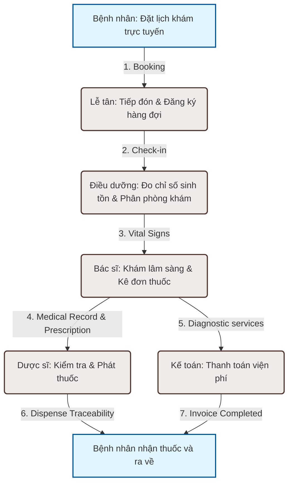

# 🏥 Enterprise Hospital Management System (HMS)

[](https://openjdk.org/)
[](https://spring.io/projects/spring-boot)
[](https://www.postgresql.org/)
[](https://nextjs.org/)
[](https://react.dev/)
[](https://playwright.dev/)
[](https://github.com/tranhquan099-commits/hospital-management-system)
[](https://github.com/tranhquan099-commits/hospital-management-system/actions)
[](https://github.com/tranhquan099-commits/hospital-management-system)

Một hệ thống quản lý bệnh viện chuyên sâu (Healthcare ERP) hỗ trợ toàn diện các luồng nghiệp vụ từ đặt lịch khám công khai, phân luồng tiếp đón (Intake/Queue), bệnh án lâm sàng (EHR), cấp phát thuốc (Pharmacy Dispensing), thanh toán viện phí (Billing) cho đến cổng thông tin tự phục vụ dành cho bệnh nhân (Patient Portal). Hệ thống được thiết kế theo mô hình **DDD (Domain-Driven Design)** và đáp ứng các tiêu chuẩn bảo mật nghiêm ngặt đối với thông tin cá nhân của bệnh nhân (PHI).

> **🟢 Production Status: Release Candidate — June 14, 2026**  
> Tất cả 7 luồng nghiệp vụ lâm sàng được triển khai và kiểm thử. 148 backend tests + 183+ E2E scenarios passing. 80.48% frontend branch coverage.  
> 📚 **[Xem tài liệu đầy đủ →](docs/HMS_DOCUMENTATION.html)** | 📂 **[Documentation Map →](docs/README.md)**

---

## 🌟 Tính Năng & Nghiệp Vụ Đặc Thù

| Nghiệp Vụ | Giải Pháp Kỹ Thuật & Kiến Trúc | Ý Nghĩa Thực Tế |
|---|---|---|
| **Đặt Lịch Khám** | Slot Lock giao dịch chống trùng lịch + Mã hóa định danh bệnh nhân. | Đảm bảo tính nhất quán lịch khám của bác sĩ; thông tin CMND/CCCD được mã hóa **AES-GCM** và đánh chỉ mục dạng **SHA-256 hash** bảo mật thông tin cá nhân (PHI). |
| **Phân Luồng Tiếp Đón** | Quản lý vòng đời Trạng thái Hàng đợi Tiếp nhận (Check-in -> Room Assignment -> Consultation -> Complete). | Bác sĩ, điều dưỡng phối hợp nhịp nhàng, tối ưu hóa thời gian chờ đợi của bệnh nhân tại phòng khám. |
| **Bệnh Án Lâm Sàng (EHR)** | Tạo bệnh án điện tử, đơn thuốc số hóa, tự động tạo tài liệu PDF đơn thuốc và gửi thư nhắc qua **Gmail API**. | Số hóa quy trình khám chữa bệnh lâm sàng, giảm thiểu thủ tục giấy tờ. |
| **Cấp Phát Thuốc** | Quản lý kho dược phẩm theo Lot/Movement; Quy trình phát thuốc đối soát liên kết trực tiếp ID bệnh án và đơn thuốc. | Kiểm soát chặt chẽ hao hụt thuốc, truy vết lịch sử phát thuốc của dược sĩ phòng hóa. |
| **Viện Phí & Doanh Thu** | Tính hóa đơn tự động theo bảng giá dịch vụ y tế, lập báo cáo doanh thu ngày/tháng cho bộ phận kế toán. | Tự động hóa kế toán dòng tiền bệnh viện. |
| **Phân Quyền RBAC** | Cấu hình **Spring Security + JWT** với 36 quyền chi tiết, phương thức bảo vệ API mức độ annotation `@PreAuthorize`. | Đảm bảo đúng vai trò (Bác sĩ, Điều dưỡng, Dược sĩ, Kế toán, Admin, Bệnh nhân) chỉ được tiếp cận đúng dữ liệu cho phép. |

---

## 📐 Luồng Nghiệp Vụ Y Tế Khép Kín (Clinical Workflow)

Sơ đồ Mermaid dưới đây biểu diễn hành trình khám chữa bệnh khép kín của bệnh nhân và sự tương tác giữa các vai trò khác nhau trong hệ thống:



---

## 📊 Số Liệu Kỹ Thuật Đã Được Kiểm Chứng (Project Metrics)

* **REST API Surface**: **118 REST API mappings** quản lý qua Spring MVC.
* **Quy Mô Giao Diện (Frontend)**: **72 trang Next.js (App Router)** đáp ứng phân hệ Staff UI, Admin UI và Patient Portal.
* **Cấu Trúc Dữ Liệu**: **20 Flyway migrations** kiến thiết nên cấu trúc **35 bảng DB** và **26 chỉ mục index** tối ưu hóa truy vấn tìm kiếm bệnh án lâm sàng.
* **Bảo Đảm Chất Lượng (Quality Gates)**:
  - Hệ thống tích hợp **148 Test Cases Backend** (Spring Boot Integration Tests kết hợp PostgreSQL Testcontainers).
  - Giao diện Frontend duy trì mức độ bao phủ code cao với **80.48% branch coverage** thông qua công cụ Vitest.
  - Vượt qua chuỗi **183 kịch bản Playwright E2E** tự động kiểm tra RBAC, luồng khám bệnh và các lỗi click-path.

---

## 📂 Kiến Trúc Mã Nguồn (DDD Architecture)

Mã nguồn backend được tổ chức theo cấu trúc Modular Monolith định hướng DDD rõ rệt:

```text
backend/
├── domain/          # Entities JPA, Enums, Bounded Context, Exceptions và Contracts
├── infrastructure/  # Spring Data repositories, PostgreSQL adapters, Gmail Client
├── application/     # Nghiệp vụ nghiệp vụ (Use Cases), dịch vụ xác thực, jobs định kỳ
├── controller/      # REST Controllers, API envelopes, Filter bảo mật
└── start/           # Composition root, cấu hình khởi chạy app, Flyway migrations
```

Quan hệ phụ thuộc giữa các module:
`domain` $\leftarrow$ `infrastructure` $\leftarrow$ `application` $\leftarrow$ `controller` $\leftarrow$ `start`

---

## 🛠️ Hướng Dẫn Khởi Chạy Nhanh (Local Setup)

### 1. Yêu Cầu Cài Đặt
- Java 17 hoặc cao hơn
- Node.js 22 & npm
- Docker Desktop

### 2. Khởi Động PostgreSQL
```bash
docker compose -f infra/docker-compose.yml up -d postgres
```

### 3. Cấu Hình Biến Môi Trường (`.env`)
Tạo file `.env` tại thư mục gốc từ `.env.example`:
```dotenv
POSTGRES_PASSWORD=hospital_pass
JWT_SECRET=your-super-secret-jwt-key-minimum-32-characters
PATIENT_IDENTIFIER_SECRET=your-separate-encryption-secret-key-minimum-32-characters
SPRING_PROFILES_ACTIVE=dev
HMS_RELEASE_DEMO_SEED_ENABLED=true  # Kích hoạt dữ liệu UAT demo phong phú
```

### 4. Khởi Chạy Backend (Chạy module `start`)
Sử dụng script PowerShell tự động load `.env`:
```powershell
.\backend\run.ps1
```
*Hoặc lệnh Maven thủ công:*
```bash
cd backend
mvn install -DskipTests
mvn spring-boot:run -f start/pom.xml
```
*Actuator health endpoint check: `http://localhost:8081/actuator/health`*

### 5. Khởi Chạy Frontend Next.js
```bash
cd frontend
npm install
npm run dev
```
*Truy cập UI tại: `http://localhost:3000`*

### 6. Tài Khoản Demo Mặc Định (Seeded Users)
| Vai Trò | Email | Mật Khẩu |
|---------|-------|----------|
| Bác sĩ (Nội khoa) | `doctor1@hospital.vn` | `Doctor@1234` |
| Bác sĩ (Tim mạch) | `doctor2@hospital.vn` | `Doctor@1234` |
| Điều dưỡng | `nurse@hospital.vn` | `Nurse@1234` |
| Lễ tân | `receptionist@hospital.vn` | `Reception@1234` |
| Dược sĩ | `pharmacist@hospital.vn` | `Pharma@1234` |
| Kế toán | `accountant@hospital.vn` | `Acc@1234` |
| Admin | `admin@hospital.vn` | `Admin@1234` |
| Bệnh nhân (Portal) | `patient@example.com` | `Patient@1234` |

> Kích hoạt `HMS_RELEASE_DEMO_SEED_ENABLED=true` để tạo thêm dữ liệu UAT tổng hợp (bệnh nhân, lịch hẹn, kho dược, audit logs).

---

## 📈 Tự Động Hóa Triển Khai (CI/CD & Observability)
- **CI Pipeline** (`ci.yml`): Tự động hóa kiểm thử biên dịch Java, chạy test tích hợp Testcontainers, kiểm linter và kiểm thử frontend (Vitest & Playwright) trên GitHub Actions, tự động đóng gói image đẩy lên GHCR.
- **CD Pipeline** (`cd.yml`): Tích hợp deploy lên máy chủ VPS bằng Docker Compose với staging → production promotion, smoke tests, và Slack notifications.
- **Rollback** (`rollback.yml`): Tự động rollback với confirmation gate khi release thất bại health check.
- **Security Scan** (`security-scan.yml`): OWASP Dependency Check, TruffleHog secret detection, Trivy container scanning.
- **Observability**: Hỗ trợ hệ thống giám sát hoạt động (**Nginx reverse proxy → Prometheus → Grafana → Loki → Tempo**) thông qua file overlay `docker-compose.observability.yml`. Cấu hình Nginx, Prometheus, Grafana, Loki, Tempo tại [`infra/`](infra/).

---

## 📚 Tài Liệu (Documentation)

Tài liệu dự án được tổ chức theo cấu trúc 12 danh mục chuyên nghiệp:

| Danh Mục | Nội Dung | Tài Liệu Chính |
|----------|----------|----------------|
| **00-overview** | Nền tảng kỹ thuật, quy trình | [`project-foundation.md`](docs/00-overview/project-foundation.md) |
| **01-business** | Yêu cầu nghiệp vụ, business rules | [`business-rules.md`](docs/01-business/business-rules.md) |
| **02-product** | PRD, feature list, roadmap | [`prd.md`](docs/02-product/prd.md) |
| **03-requirements** | SRS, permissions matrix | [`permissions-matrix.md`](docs/03-requirements/permissions-matrix.md) |
| **04-architecture** | DDD, security, coding standards | [`architecture.md`](docs/04-architecture/architecture.md) |
| **05-api** | API contract, auth, error codes | [`API Contract →`](docs/API_CONTRACT.md) |
| **06-database** | Schema, migrations, seed data | [`db-schema.md`](docs/06-database/db-schema.md) |
| **07-flows** | Business flows, state machines | [`end-to-end-business-flow.md`](docs/07-flows/end-to-end-business-flow.md) |
| **09-testing** | Test strategy, test plan | [`test-strategy.md`](docs/09-testing/test-strategy.md) |
| **10-deployment** | CI/CD, Docker, env variables | [`deployment-guide.md`](docs/10-deployment/deployment-guide.md) |
| **12-handover** | Handover, onboarding, known issues | [`handover-document.md`](docs/12-handover/handover-document.md) |

> 📄 **[Xem tài liệu tổng hợp dạng HTML →](docs/HMS_DOCUMENTATION.html)** | 📂 **[Documentation Index →](docs/README.md)** | 📋 **[API Contract →](docs/API_CONTRACT.md)**
