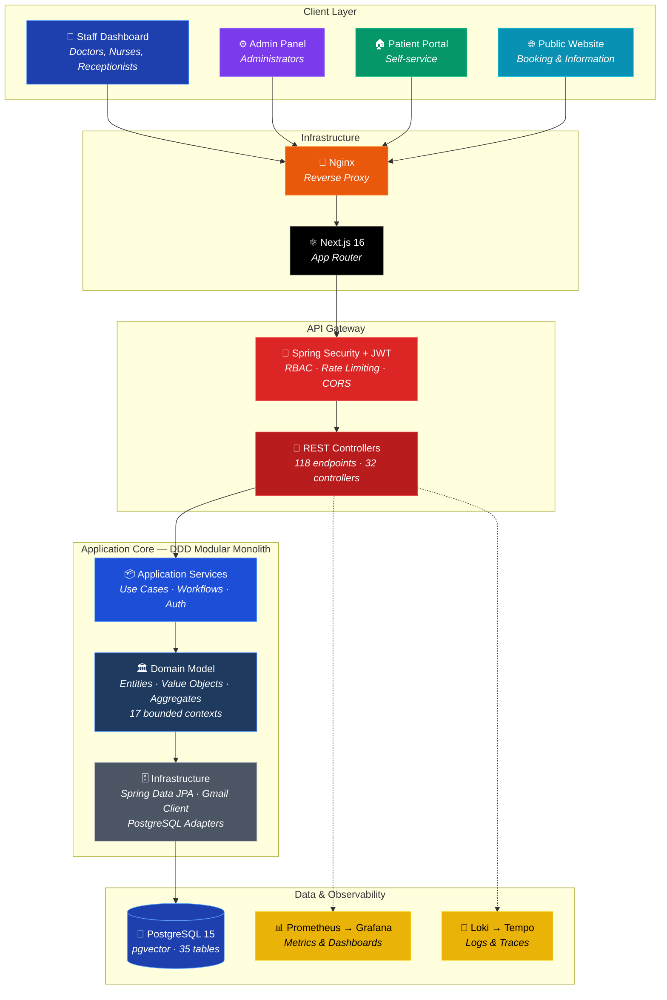
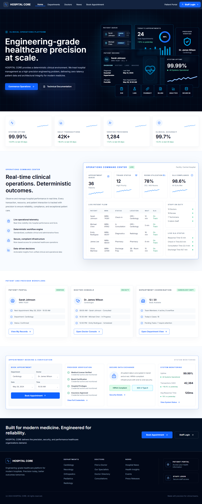
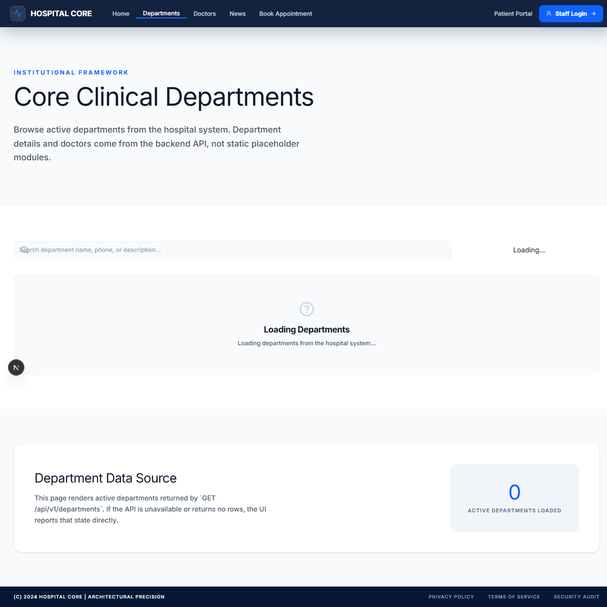
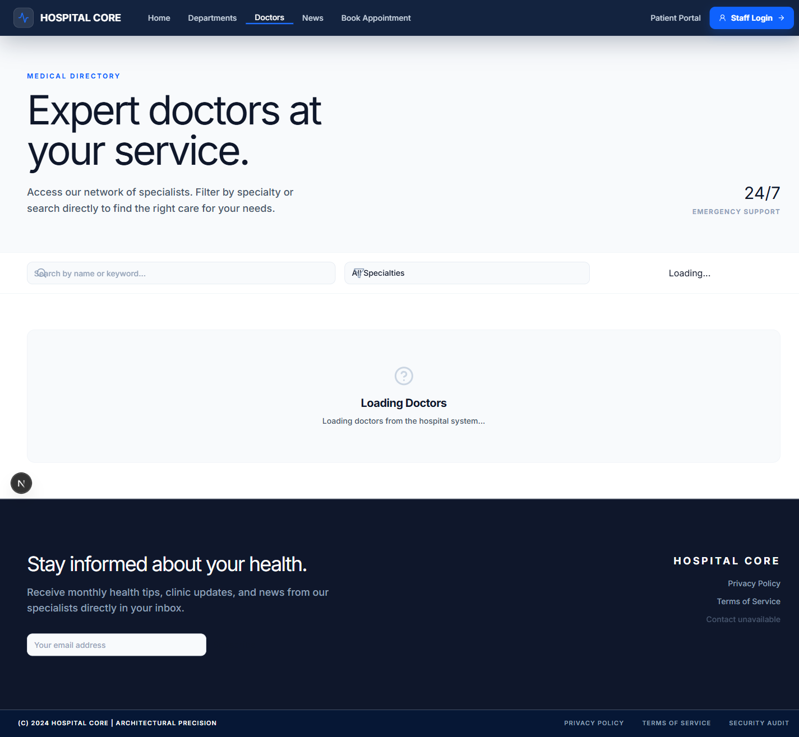
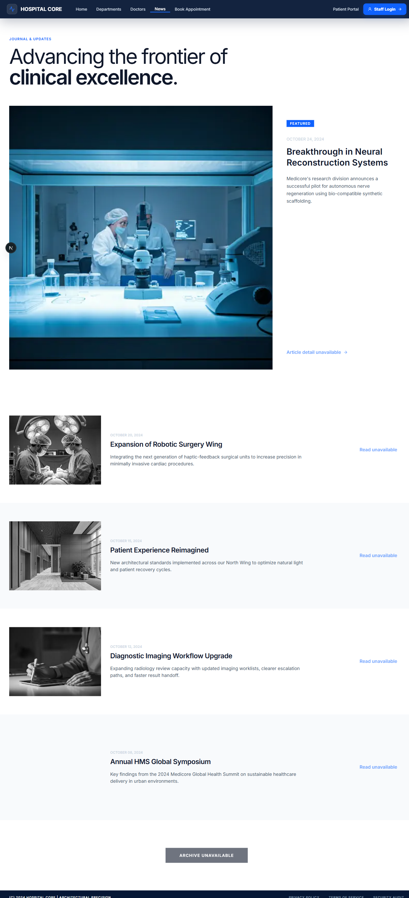
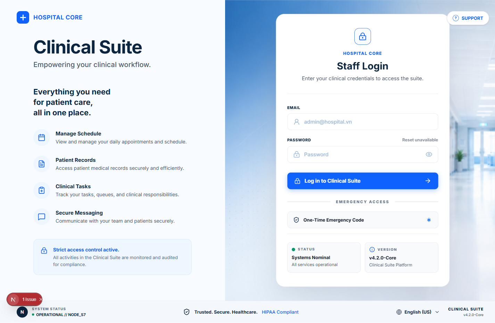
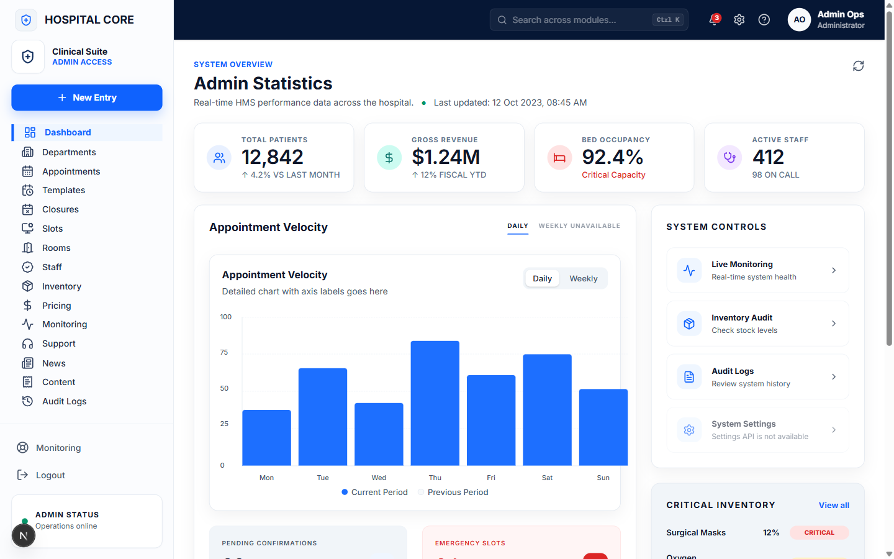
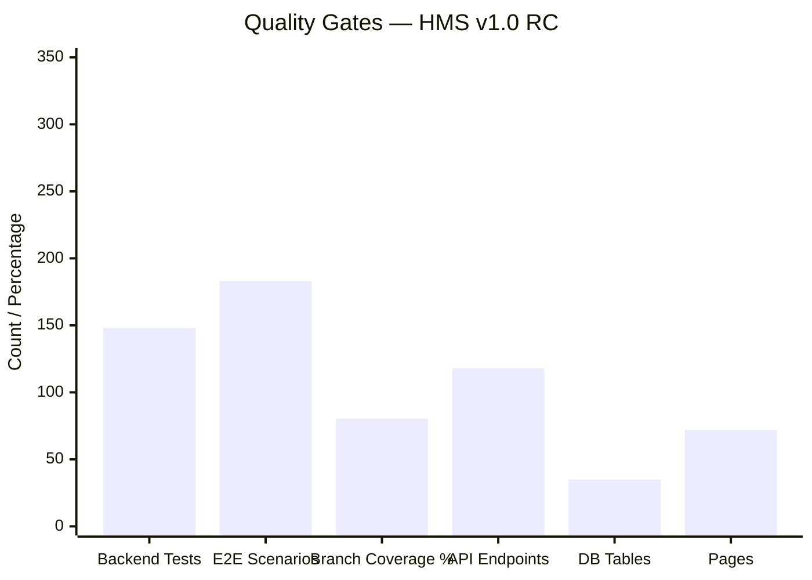

# 🏥 Enterprise Hospital Management System (HMS)

[](https://openjdk.org/)
[](https://spring.io/projects/spring-boot)
[](https://www.postgresql.org/)
[](https://nextjs.org/)
[](https://react.dev/)
[](https://playwright.dev/)
[](https://docker.com)
[](https://github.com/tranhquan099-commits/hospital-management-system/actions)
[](https://github.com/qwan30/hospital-management-system)
[](https://github.com/qwan30/hospital-management-system/actions)
[](https://github.com/qwan30/hospital-management-system)

**A full-stack healthcare ERP system** supporting end-to-end hospital clinical workflows — from public appointment booking, patient intake & queue triage, electronic health records (EHR), pharmacy dispensing with lot-level traceability, to billing & revenue reporting. Built with **Domain-Driven Design (DDD)** principles and strict **PHI (Protected Health Information)** compliance — AES-GCM encryption, SHA-256 hashed indexing, JWT-based RBAC with 36 granular permissions.

> **🟢 Production Status: Release Candidate 1.0 — June 14, 2026**
> All 7 clinical workflows implemented and verified. 148 backend integration tests + 183+ Playwright E2E scenarios passing. 80.48% frontend branch coverage.
>
> 📚 **[Interactive Documentation Portal →](docs/HMS_DOCUMENTATION.html)** | 📂 **[Documentation Index →](docs/README.md)** | 📋 **[API Contract →](docs/05-api/api-contract.md)** | 📝 **[Changelog →](CHANGELOG.md)**

---

## Why This Project Exists

Healthcare digitization in emerging markets faces a critical gap: existing ERP systems are either too expensive or lack PHI compliance. This project demonstrates a production-grade hospital ERP built entirely with open-source technology while meeting strict healthcare data protection standards.

## Key Architecture Decisions

| Decision | Rationale | ADR |
|----------|-----------|-----|
| **Modular Monolith** (not microservices) | Healthcare workflows are tightly coupled (booking → queue → EHR → billing). DDD bounded contexts prevent coupling within a single deployable. No distributed transaction overhead. | [ADR-001](docs/04-architecture/adr/ADR-001-modular-monolith.md) |
| **JWT + httpOnly Refresh Cookies** | Stateless auth avoids server-side session storage. httpOnly cookies prevent XSS token theft. 15-min access token TTL limits blast radius. | [ADR-003](docs/04-architecture/adr/ADR-003-jwt-auth.md) |
| **AES-GCM PHI Encryption** | Patient identifiers encrypted at rest, indexed by SHA-256 hash for lookup without decryption. Plaintext never stored. | [ADR-004](docs/04-architecture/adr/ADR-004-phi-encryption.md) |
| **Repositories in Domain Layer** | Domain owns data access contracts — infrastructure implements them. Strict Dependency Inversion prevents infrastructure concerns from leaking into business logic. | [ADR-002](docs/04-architecture/adr/ADR-002-repositories-in-domain.md) |

## Technical Challenges Solved

| Challenge | Solution | Implementation |
|-----------|----------|----------------|
| **Double-booking prevention** | Transactional slot locking with optimistic concurrency control | `AppointmentWriteService` in `appointment` bounded context |
| **PHI compliance** | AES-GCM encrypt at rest + SHA-256 hash for indexing + TLS in transit | `PatientIdentifierProtector` in `patient` bounded context |
| **Fine-grained RBAC** | 36 method-level `@PreAuthorize` permissions across 7 roles | `RbacAuthorizationService` in `security` bounded context |
| **Queue state integrity** | Strict state machine: CHECKED_IN → IN_CONSULTATION → COMPLETED. Invalid transitions rejected at domain level. | `AppointmentWorkflowService` in `appointment` bounded context |

---

## 🎯 System Architecture Overview



---

## 🏥 End-to-End Clinical Workflow

```mermaid
graph LR
    subgraph "1️⃣ Booking"
        P["🧑 Patient<br/><i>Books online</i>"]
    end

    subgraph "2️⃣ Intake & Queue"
        R["👩‍💼 Receptionist<br/><i>Check-in · Register Queue</i>"]
        N1["👩‍⚕️ Nurse<br/><i>Vital Signs · Room Assignment</i>"]
    end

    subgraph "3️⃣ Consultation"
        D1["👨‍⚕️ Doctor<br/><i>Examination · Diagnosis<br/>E-Prescription · PDF Export</i>"]
    end

    subgraph "4️⃣ Pharmacy"
        PH["💊 Pharmacist<br/><i>Dispense · Lot Tracking<br/>Inventory Movement</i>"]
    end

    subgraph "5️⃣ Billing"
        AC["💰 Accountant<br/><i>Invoice · Payment<br/>Revenue Report</i>"]
    end

    subgraph "6️⃣ Completion"
        OUT["✅ Patient<br/><i>Receives medication<br/>& invoice</i>"]
    end

    P -->|"1. Book Appointment"| R
    R -->|"2. Check-in"| N1
    N1 -->|"3. Vital Signs Recorded"| D1
    D1 -->|"4. E-Prescription"| PH
    D1 -->|"5. Services Billed"| AC
    PH -->|"6. Medication Dispensed"| OUT
    AC -->|"7. Payment Collected"| OUT

    classDef patient fill:#059669,stroke:#34d399,color:#fff,stroke-width:2px
    classDef staff fill:#1e40af,stroke:#3b82f6,color:#fff,stroke-width:2px
    classDef doctor fill:#7c3aed,stroke:#a78bfa,color:#fff,stroke-width:2px
    classDef pharma fill:#ea580c,stroke:#fb923c,color:#fff,stroke-width:2px
    classDef finance fill:#b91c1c,stroke:#ef4444,color:#fff,stroke-width:2px
    classDef done fill:#22c55e,stroke:#4ade80,color:#fff,stroke-width:2px

    class P,OUT patient
    class R,N1 staff
    class D1 doctor
    class PH pharma
    class AC finance
```



---

## 📸 System Screenshots

<div align="center">

### 🏠 Public Homepage


*Modern landing page with department search, doctor highlights, and appointment booking entry point*

### 🏥 Departments & Doctors
| Departments | Doctors Directory |
|:-----------:|:-----------------:|
|  |  |
| *Browse active clinical departments* | *Find doctors by specialty* |

### 📰 News & Content


*Hospital news, health articles, and public announcements*

### 🔐 Staff Login (Clinical Suite)


*Professional clinical-suite login with system status, version info, and secure access controls*

### 📊 Admin Dashboard


*Real-time KPI cards — total patients, gross revenue, bed occupancy, active staff — with quick-action tiles*

</div>

---

## 🎯 Key Features & Business Value

| # | Clinical Domain | Technical Implementation | Business Impact |
|---|---------------|-------------------------|-----------------|
| 🏥 | **Appointment Booking** | Transactional slot locking prevents double-booking; AES-GCM encrypted patient identity (CCCD/CMND) with SHA-256 hashed indexing | Guarantees scheduling consistency; PHI-compliant identity protection |
| 🔄 | **Patient Intake & Queue** | Full lifecycle state machine: `CHECKED_IN → VITAL_SIGNS → ASSIGNED → IN_CONSULTATION → COMPLETED` | Streamlined patient flow; optimized doctor utilization; reduced wait times |
| 📋 | **Electronic Health Records (EHR)** | Digital medical records with diagnosis, prescriptions; automated PDF generation; Gmail API reminder integration | Paperless clinical workflow; prescription accuracy; patient follow-up |
| 💊 | **Pharmacy Dispensing** | Lot-level inventory tracking with FIFO expiration management; dispense operations cross-referenced to medical record IDs | Full drug traceability; prevented stockouts via low-stock alerts; audit compliance |
| 💰 | **Billing & Revenue** | Automated invoice generation from service pricing rules; daily/monthly revenue reports with filtering | Cash flow automation; financial transparency for accounting department |
| 🔐 | **RBAC Security** | Spring Security + JWT with 36 granular permissions; `@PreAuthorize` method-level protection; httpOnly refresh cookies with rotation | Enforced separation of duties across 7 roles; HIPAA-aligned access control |

---

## 📊 Verified Project Metrics



| Metric | Value | Status |
|--------|-------|--------|
| **Backend Integration Tests** | 148 (Spring Boot + Testcontainers) | ✅ All Passing |
| **E2E Playwright Scenarios** | 183+ (RBAC, Clinical, Click-path) | ✅ All Passing |
| **Frontend Branch Coverage** | 80.48% (Vitest) | ✅ Above 80% Target |
| **REST API Endpoints** | 118 mappings across 32 controllers | ✅ Verified |
| **Database Schema** | 35 tables, 26 indexes, 20 Flyway migrations | ✅ Migrated |
| **RBAC Permissions** | 36 granular permissions covering 7 roles | ✅ Enforced |
| **CI/CD Pipelines** | Build → Test → Docker → Deploy → Rollback | ✅ Automated |

---

## 🏗️ DDD Architecture — Modular Monolith

```
 ┌─────────────────────────────────────────────────────────┐
 │                    start (Composition Root)              │
 │         Flyway Migrations · App Config · Bootstrap       │
 ├─────────────────────────────────────────────────────────┤
 │                   controller (40 Controllers)            │
 │   ┌──────────┬──────────┬──────────┬────────────────┐   │
 │   │   Auth   │  Admin   │ Clinical │  PatientPortal │   │
 │   └──────────┴──────────┴──────────┴────────────────┘   │
 ├─────────────────────────────────────────────────────────┤
 │                 application (Use Cases)                  │
 │   ┌──────────┬──────────┬──────────┬────────────────┐   │
 │   │ Workflow │  Read    │  Write   │   Auth/Security│   │
 │   │ Services │ Services │ Services │   Services     │   │
 │   └──────────┴──────────┴──────────┴────────────────┘   │
 ├─────────────────────────────────────────────────────────┤
 │               infrastructure (Adapters)                  │
 │     Spring Data JPA Repositories · Gmail Client · PDF    │
 ├─────────────────────────────────────────────────────────┤
 │                  domain (17 Bounded Contexts)            │
 │   ┌──────┬──────┬──────┬──────┬──────┬──────┬──────┐    │
 │   │Patient│Appt  │Queue │MedRec│Inven │Invoice│Admin│    │
 │   └──────┴──────┴──────┴──────┴──────┴──────┴──────┘    │
 │   ┌──────┬──────┬──────┬──────┬──────┬──────┬──────┐    │
 │   │ Lab  │ Rx   │User  │Audit │Dept  │Timeslot│Cont│    │
 │   └──────┴──────┴──────┴──────┴──────┴──────┴──────┘    │
 └─────────────────────────────────────────────────────────┘
     Dependency Flow: domain ← infrastructure ← application ← controller ← start
```

**17 Bounded Contexts:** `admin` · `appointment` · `audit` · `common` · `content` · `department` · `email` · `inventory` · `invoice` · `lab` · `medicalrecord` · `patient` · `patientauth` · `patientportal` · `prescription` · `timeslot` · `user`

---

## 🚀 Quick Start

### Prerequisites
- **Java 17+** · **Node.js 22+** · **Docker Desktop**

### 1. Start PostgreSQL
```bash
docker compose -f infra/docker-compose.yml up -d postgres
```

### 2. Configure Environment
```bash
cp .env.example .env
```
Required secrets: `POSTGRES_PASSWORD`, `JWT_SECRET` (≥32 chars), `PATIENT_IDENTIFIER_SECRET` (≥32 chars)

### 3. Start Backend (Spring Boot)
```powershell
.\backend\run.ps1                    # PowerShell — auto-loads .env
```
```bash
cd backend && mvn install -DskipTests && mvn spring-boot:run -f start/pom.xml
```
Health check: `http://localhost:8081/actuator/health`

### 4. Start Frontend (Next.js)
```bash
cd frontend && npm install && npm run dev
```
Open: `http://localhost:3000`

### 5. Full Stack (Docker Compose)
```bash
docker compose -f infra/docker-compose.yml up -d --build    # Backend + Frontend + PostgreSQL
docker compose -f infra/docker-compose.yml -f infra/docker-compose.observability.yml up -d   # + Monitoring
```

### Demo Accounts

| Role | Email | Password |
|------|-------|----------|
| 👨‍⚕️ Doctor (Internal Medicine) | `doctor1@hospital.vn` | `Doctor@1234` |
| 👨‍⚕️ Doctor (Cardiology) | `doctor2@hospital.vn` | `Doctor@1234` |
| 👩‍⚕️ Nurse | `nurse@hospital.vn` | `Nurse@1234` |
| 👩‍💼 Receptionist | `receptionist@hospital.vn` | `Reception@1234` |
| 💊 Pharmacist | `pharmacist@hospital.vn` | `Pharma@1234` |
| 💰 Accountant | `accountant@hospital.vn` | `Acc@1234` |
| ⚙️ Admin | `admin@hospital.vn` | `Admin@1234` |
| 🧑 Patient (Portal) | `patient@example.com` | `Patient@1234` |

---

## 🧪 Testing & Quality

```bash
# Backend — 148 integration tests
cd backend && mvn verify

# Frontend — unit tests (Vitest)
cd frontend && npm run test:unit

# Frontend — E2E tests (Playwright)
cd frontend && npm run test:e2e:ci       # Full CI suite
cd frontend && npm run test:e2e:ui       # UI smoke & accessibility
cd frontend && npm run test:e2e:integrated  # Backend-integrated auth & booking
```

---

## 📈 CI/CD & Observability

| Pipeline | Trigger | Actions |
|----------|---------|---------|
| **CI** (`ci.yml`) | Push / PR | Java build · Testcontainers · Vitest · Playwright · Docker build → GHCR |
| **CD** (`cd.yml`) | Release tag | Deploy to VPS · Smoke tests · Slack notification |
| **Rollback** (`rollback.yml`) | Manual | Automated rollback with health check gate |
| **Security** (`security-scan.yml`) | Schedule / Push | OWASP DC · TruffleHog · Trivy container scan |

**Observability Stack:** `Nginx → Frontend → Backend → Prometheus → Grafana + Loki → Tempo`

Configurations in [`infra/observability/`](infra/observability/) — Prometheus metrics, Grafana dashboards, Loki log aggregation, Tempo distributed tracing.

---

## 📚 Documentation

| Section | Content | Primary Doc |
|---------|---------|-------------|
| **00-overview** | Project foundation, conventions, onboarding | [`project-foundation.md`](docs/00-overview/project-foundation.md) |
| **01-business** | Business rules, glossary, scope | [`business-rules.md`](docs/01-business/business-rules.md) |
| **02-product** | PRD, feature list, release plan | [`prd.md`](docs/02-product/prd.md) |
| **03-requirements** | SRS, permissions, use cases | [`srs.md`](docs/03-requirements/srs.md) |
| **04-architecture** | DDD, security, coding standards | [`architecture.md`](docs/04-architecture/architecture.md) |
| **05-api** | API contract, auth, error codes | [`api-contract.md`](docs/05-api/api-contract.md) |
| **06-database** | Schema, migrations, seed data | [`db-schema.md`](docs/06-database/db-schema.md) |
| **07-flows** | Business flows, state machines | [`end-to-end-business-flow.md`](docs/07-flows/end-to-end-business-flow.md) |
| **08-ui-ux** | Design system, screen specs | [`design-system.md`](docs/08-ui-ux/02_design-system/design-system.md) |
| **09-testing** | Test strategy, plan, RTM | [`test-strategy.md`](docs/09-testing/test-strategy.md) |
| **10-deployment** | CI/CD, Docker, env variables | [`deployment-guide.md`](docs/10-deployment/deployment-guide.md) |
| **11-operations** | Admin guide, troubleshooting | [`admin-guide.md`](docs/11-operations/admin-guide.md) |
| **12-handover** | Handover, onboarding, known issues | [`handover-document.md`](docs/12-handover/handover-document.md) |

> 📄 **[Interactive Documentation Portal →](docs/HMS_DOCUMENTATION.html)** | 📂 **[Full Documentation Index →](docs/README.md)**

---

## 🔒 Security & Compliance

- **PHI Protection:** Patient identifiers (CCCD/CMND) encrypted with AES-GCM, indexed by SHA-256 hash — plaintext never stored
- **Authentication:** JWT access tokens (15min TTL) + httpOnly refresh cookies (7-day rotation)
- **Authorization:** 36 RBAC permissions at method-level via `@PreAuthorize`
- **Rate Limiting:** Sliding-window rate limit on public endpoints (configurable, default 30/min)
- **CORS:** Configurable allowed origins via environment variables
- **Audit Trail:** Full audit logging for all state-changing operations

---

*Built with ❤️ following Domain-Driven Design, Clean Architecture principles, and healthcare industry compliance standards.*
