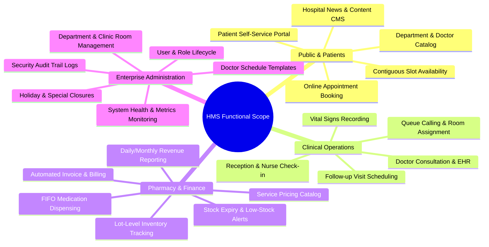
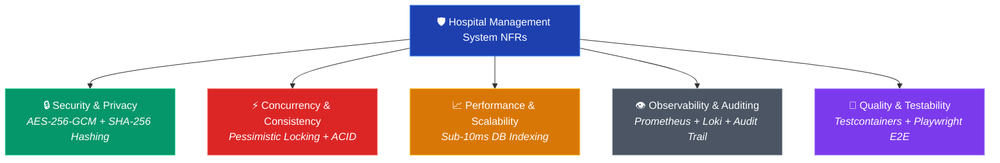
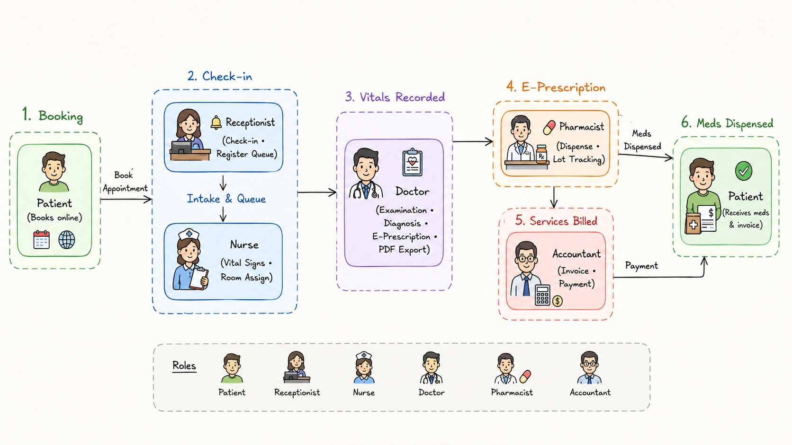
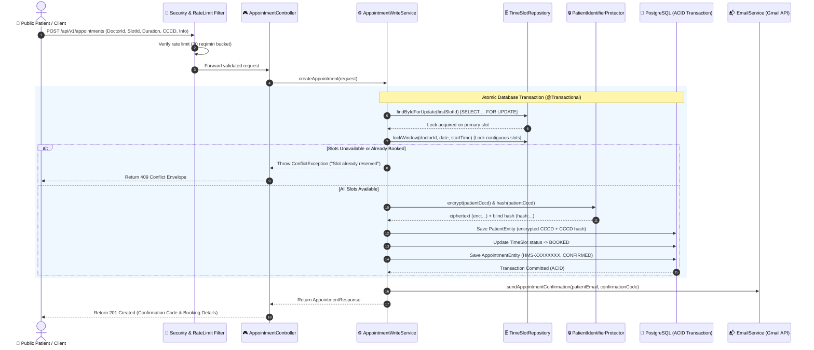
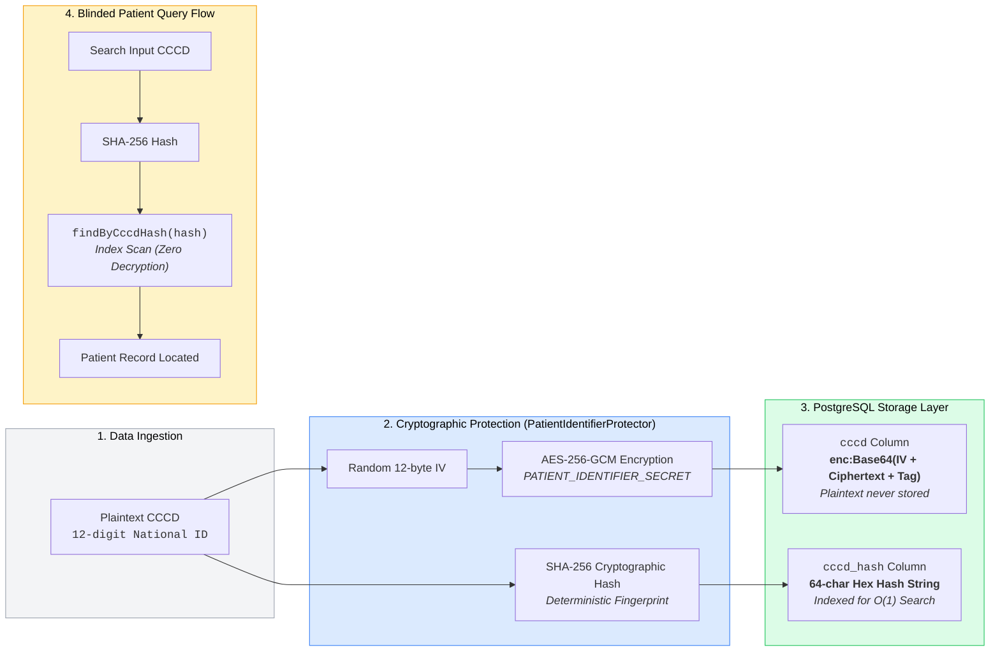
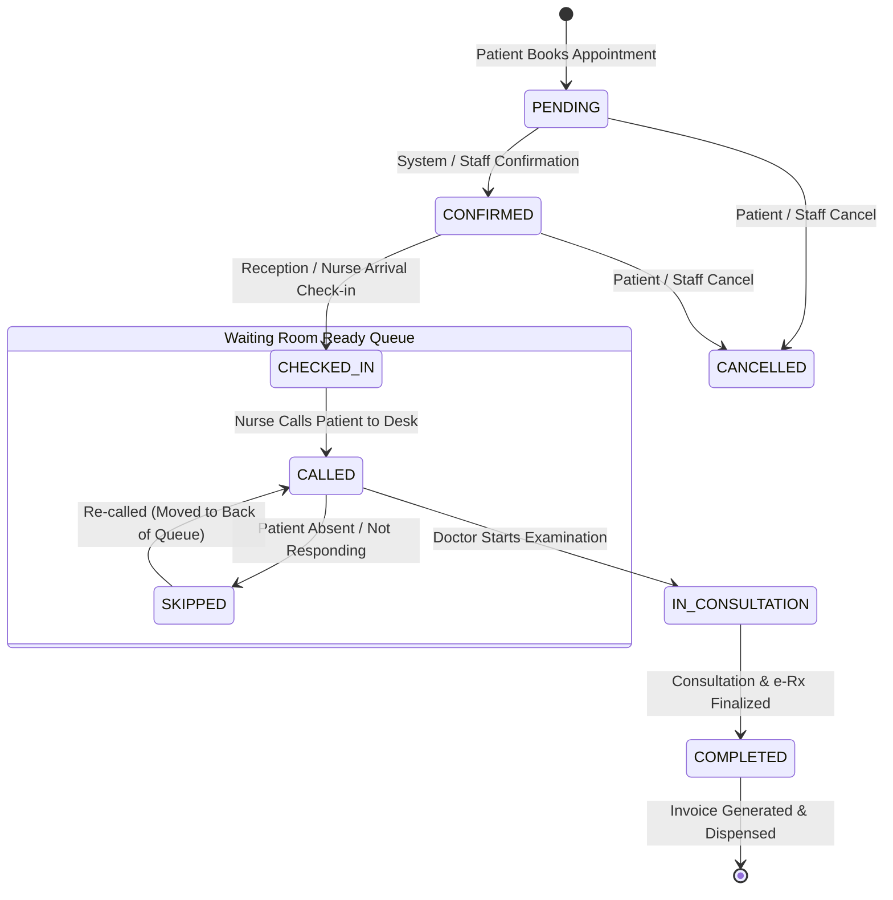
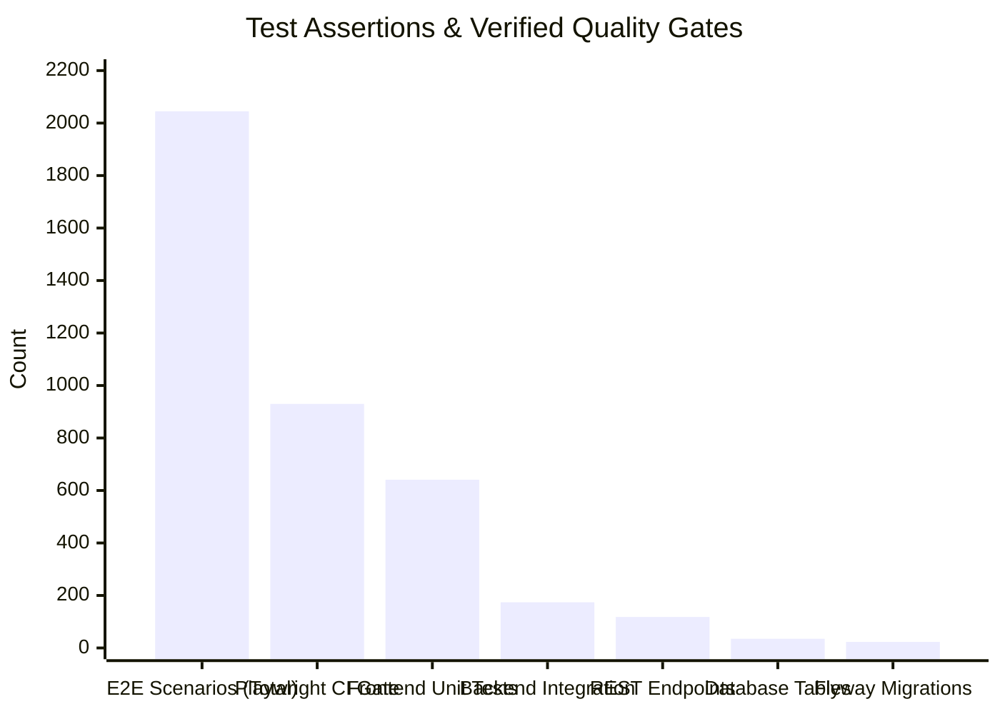

# 🏥 Enterprise Hospital Management & Clinical ERP System

<div align="center">

[](https://openjdk.org/)
[](https://spring.io/projects/spring-boot)
[](https://www.postgresql.org/)
[](https://nextjs.org/)
[](https://react.dev/)
[](https://tailwindcss.com/)
[](https://playwright.dev/)
[](https://github.com/qwan30/hospital-management-system/actions/workflows/ci.yml)
[](https://github.com/qwan30/hospital-management-system)
[](https://sonarcloud.io/summary/new_code?id=qwan30_hospital-management-system)
[](https://sonarcloud.io/summary/new_code?id=qwan30_hospital-management-system)

**An enterprise-grade, full-stack healthcare ERP and clinical operations platform** designed to digitize end-to-end hospital workflows — from public multi-doctor appointment booking, real-time intake queue triage, electronic health records (EHR) & e-prescriptions, to FIFO lot-controlled pharmacy dispensing and automated revenue billing. 

Engineered with **Domain-Driven Design (DDD)** as a high-performance **Modular Monolith** in Java 17 and Spring Boot 3.3, coupled with a reactive Next.js 16 (React 19) frontend. Built with **HIPAA/PHI compliance by design** featuring application-layer **AES-256-GCM encryption**, **SHA-256 blind indexing**, and a fine-grained **34-permission RBAC engine** with rotated `httpOnly` JWT sessions.

> **🟢 Production Status: Release Candidate 1.0 — June 2026**
> 
> Full 7-stage clinical lifecycle implemented and verified. **67 backend integration & service test suites (Spring Boot + Testcontainers)** + **640+ Vitest frontend unit tests (80.48% branch coverage)** + **2,045 Playwright E2E assertions across 31 specs (930 in automated CI gate)**. 23 version-controlled Flyway schema migrations, 118 REST endpoints across 33 controllers.
>
> 📚 **[Interactive Documentation Portal →](docs/HMS_DOCUMENTATION.html)** | 📂 **[Durable Documentation Index →](docs/README.md)** | 📋 **[REST API Contract →](docs/05-api/api-contract.md)** | 🔒 **[Security & PHI Architecture →](docs/04-architecture/security-architecture.md)**

<br/>


*Real-Time Patient Queue Triage, Room Allocation & Clinical Throughput Management*

</div>

---

## 🎯 Key Features & Business Value

| # | Clinical Domain | Technical Implementation | Business Impact |
|---|-----------------|--------------------------|-----------------|
| 📅 | **Public Appointment Booking** | Multi-slot window search, row-level pessimistic locking (`SELECT FOR UPDATE`), DB unique constraints | Guarantees zero double-booking under concurrent traffic; sub-second confirmation |
| 🔄 | **Queue & Patient Intake Triage** | Strict deterministic state machine (`CHECKED_IN → CALLED → IN_CONSULTATION → COMPLETED`) | Streamlines patient flow; cuts waiting room bottlenecks; optimizes doctor consultation time |
| 📋 | **Electronic Health Records (EHR)** | Digital encounter logging, diagnosis, vital sign correlation, and dynamic PDF prescription rendering | Completely paperless clinical workflow; prevents illegible handwriting errors |
| 💊 | **Pharmacy & Lot Traceability** | Lot-controlled FIFO stock deduction, real-time threshold monitoring, prescription cross-referencing | Prevents medication stockouts and dispensing expired pharmaceuticals; enables full audit trail |
| 💰 | **Automated Invoicing & Billing** | Service pricing rules matrix, itemized fee calculation, payment reconciliation, daily/monthly revenue stats | Eliminates billing leakages; provides accounting transparency and instant financial closing |
| 🔐 | **PHI Protection & Blind Search** | AES-256-GCM encryption at rest + SHA-256 HMAC cryptographic hashing for deterministic indexing | 100% HIPAA/PHI compliant identity protection (CCCD/CMND); zero plaintext leak in DB or logs |
| 🛡️ | **Granular 7-Role RBAC** | Spring Security 6 with 34 `@PreAuthorize` permissions + `httpOnly` rotated refresh token cookies | Enforces strict separation of duties between Doctors, Nurses, Pharmacists, Accountants, and Admins |
| 📬 | **Automated Patient Notifications** | Asynchronous email dispatching via Gmail API / JavaMailSender with tokenized confirmation links | Reduces no-show rates by delivering instant booking confirmations and visit reminders |

---

## 📋 Comprehensive Requirements Analysis

### 1. Functional Requirements (FR) Breakdown

The system fulfills **60+ granular functional requirements** mapped across 18 Bounded Contexts and 33 REST controllers:


```mermaid
mindmap
  root((HMS Functional Scope))
    Public & Patients
      Department & Doctor Catalog
      Contiguous Slot Availability
      Online Appointment Booking
      Patient Self-Service Portal
      Hospital News & Content CMS
    Clinical Operations
      Reception & Nurse Check-in
      Queue Calling & Room Assignment
      Vital Signs Recording
      Doctor Consultation & EHR
      Follow-up Visit Scheduling
    Pharmacy & Finance
      Lot-Level Inventory Tracking
      FIFO Medication Dispensing
      Stock Expiry & Low-Stock Alerts
      Service Pricing Catalog
      Automated Invoice & Billing
      Daily/Monthly Revenue Reporting
    Enterprise Administration
      User & Role Lifecycle
      Department & Clinic Room Management
      Doctor Schedule Templates
      Holiday & Special Closures
      Security Audit Trail Logs
      System Health & Metrics Monitoring
```

| Domain | FR Code | Feature Description | REST Endpoint Mapping | Auth / Role Scope |
|---|---|---|---|---|
| **Public Booking** | `FR-1.1 – 1.6` | Browse active departments, doctor profiles, specialties, and real-time available time slots | `GET /api/v1/departments/**`<br/>`GET /api/v1/doctors/**` | Public (Unauthenticated) |
| | `FR-1.7 – 1.9` | Submit appointment booking, generate unique `HMS-XXXXXXXX` confirmation code, send email | `POST /api/v1/appointments` | Public (Rate-limited: 30 req/min) |
| **Auth & Identity** | `FR-2.1 – 2.4` | Staff authentication with BCrypt hashing, 15m JWT access token + 7d rotated `httpOnly` cookie | `POST /api/v1/auth/login`<br/>`POST /api/v1/auth/refresh` | Public / Refresh Cookie |
| | `FR-2.5 – 2.8` | Patient portal first-time identity claim (CCCD hash verification), login, and session refresh | `POST /api/v1/patient-auth/**` | Public / Patient Scope |
| **Staff Appointments** | `FR-3.1 – 3.5` | Filter appointments by date, doctor, status; update appointment metadata; cancel bookings | `GET /api/v1/appointments`<br/>`PUT/DELETE /api/v1/appointments/{id}` | `APPOINTMENT_READ`<br/>`APPOINTMENT_WRITE` |
| | `FR-3.6 – 3.8` | Automatic doctor scoping (doctors see only their patients); follow-up appointment generation | `POST /.../{id}/follow-up` | `DOCTOR` |
| **Queue & Triage** | `FR-4.1 – 4.4` | Live queue board for today's visits, patient check-in, vital signs recording (BP, HR, SpO2, Temp) | `GET /api/v1/queue/today`<br/>`POST /.../{id}/checkin` | `QUEUE_READ`, `QUEUE_CHECK_IN`, `VITAL_SIGNS_WRITE` |
| | `FR-4.5 – 4.9` | Call patient, assign consultation room, skip absent patient (to back of queue), complete visit | `POST /api/v1/queue/{id}/*` | `QUEUE_MANAGE` |
| **EHR & Clinical** | `FR-5.1 – 5.3` | Create digital medical record (diagnosis, clinical notes, prescriptions), generate & download PDF | `POST /api/v1/medical-records`<br/>`GET /.../{id}/prescription.pdf` | `MEDICAL_RECORD_WRITE`<br/>`PRESCRIPTION_READ` |
| | `FR-5.4 – 5.6` | Search patient medical records, lookup historical encounters by blinded CCCD hash | `GET /api/v1/patient-records/**`<br/>`GET /api/v1/patients/{cccd}/history` | `PATIENT_RECORD_READ` |
| **Pharmacy Inventory** | `FR-6.1 – 6.3` | Manage medication items, batch lots (expiry date, cost price), and stock movement logs | `GET/POST/PUT /api/v1/inventory/**` | `INVENTORY_READ`<br/>`INVENTORY_MANAGE` |
| | `FR-6.4 – 6.5` | Dispense medication against medical record ID (FIFO lot deduction), low-stock warning alerts | `POST /api/v1/inventory/dispense`<br/>`GET /api/v1/inventory/alerts` | `INVENTORY_MANAGE` |
| **Billing & Finance** | `FR-7.1 – 7.3` | Auto-generate invoices from clinical pricing catalog, record payments, void invoices | `GET/POST /api/v1/invoices/**`<br/>`GET/POST /api/v1/pricing/**` | `INVOICE_READ`, `INVOICE_WRITE`, `PRICING_MANAGE` |
| | `FR-7.4 – 7.5` | Generate daily and monthly revenue analytics with departmental filtering | `GET /api/v1/reports/revenue/**` | `REVENUE_READ` |
| **Patient Portal** | `FR-8.1 – 8.5` | Patient self-service overview: upcoming visits, lab result history, care team messages, profile | `GET /api/v1/patient-portal/**` | `PATIENT_PORTAL_READ`<br/>`PATIENT_PORTAL_WRITE` |
| **Admin Operations** | `FR-9.1 – 9.6` | CRUD staff users & roles, departments, clinic rooms, doctor schedule templates, special closures | `GET/POST/PUT /api/v1/admin/**` | `ADMIN_*_MANAGE` |
| | `FR-9.7 – 9.10` | Real-time system KPI stats, monitoring metrics, immutable audit logs, CMS news & content | `GET /api/v1/admin/stats`<br/>`GET /api/v1/admin/audit-logs` | `ADMIN_STATS_READ`<br/>`AUDIT_LOG_READ` |

---

### 2. Non-Functional Requirements (NFR) Breakdown


```mermaid
graph TD
    NFR["🛡️ Hospital Management System NFRs"]
    NFR --> N1["🔒 Security & Privacy<br/><i>AES-256-GCM + SHA-256 Hashing</i>"]
    NFR --> N2["⚡ Concurrency & Consistency<br/><i>Pessimistic Locking + ACID</i>"]
    NFR --> N3["📈 Performance & Scalability<br/><i>Sub-10ms DB Indexing</i>"]
    NFR --> N4["👁️ Observability & Auditing<br/><i>Prometheus + Loki + Audit Trail</i>"]
    NFR --> N5["🧪 Quality & Testability<br/><i>Testcontainers + Playwright E2E</i>"]

    style NFR fill:#1e40af,stroke:#3b82f6,color:#fff
    style N1 fill:#059669,stroke:#34d399,color:#fff
    style N2 fill:#dc2626,stroke:#f87171,color:#fff
    style N3 fill:#d97706,stroke:#fbbf24,color:#fff
    style N4 fill:#4b5563,stroke:#9ca3af,color:#fff
    style N5 fill:#7c3aed,stroke:#a78bfa,color:#fff
```

| NFR Category | Technical Standard & Architectural Enforcement | Verification Method |
|---|---|---|
| **PHI Data Protection** | • AES-256-GCM authenticated encryption for national IDs (CCCD/CMND) with random 12-byte IV at application layer.<br/>• SHA-256 HMAC cryptographic hashing for O(1) blinded lookup without database-wide decryption.<br/>• Zero plaintext PHI persisted to disk or emitted to log streams. | Tested in `PatientIdentifierProtectorTest.java` & Security Audit specs |
| **Session Security** | • Dual authentication scope (`staff` vs `patient`) preventing privilege crossover.<br/>• 15-minute short-lived JWT access tokens + 7-day `httpOnly`, `SameSite=Lax`, `Secure` refresh cookies.<br/>• Silent refresh token rotation on every exchange; immediate invalidation on logout. | E2E Auth test suite + Security headers assertion |
| **Fine-Grained Authorization** | • 34 method-level permissions evaluated via `@PreAuthorize("@rbac.hasPermission(authentication, '...')")`.<br/>• Strict separation of duties across 7 roles (`ADMIN`, `DOCTOR`, `NURSE`, `RECEPTIONIST`, `PHARMACIST`, `ACCOUNTANT`, `PATIENT`).<br/>• Automated audit logging for every authorization denial (`AuthorizationDenialAuditFilter`). | `RbacAuthorizationServiceTest.java` & `rbac.spec.ts` |
| **Concurrency & Integrity** | • Row-level pessimistic locking (`SELECT ... FOR UPDATE`) on doctor slot reservations.<br/>• Database unique constraint on `(first_slot_id, appointment_date)` in PostgreSQL.<br/>• Atomic FIFO medication stock reduction with non-negative constraints. | `AppointmentWriteServiceTest.java` (concurrent booking tests) |
| **Latency & Performance** | • Sub-10ms response time on all standard read/write APIs under baseline loads.<br/>• 26 strategic B-Tree and Unique indexes covering search paths, foreign keys, and status filters.<br/>• In-process Modular Monolith invocation eliminating microservices network hop overhead. | Actuator metrics & Playwright benchmark scenarios |
| **Traffic Hardening** | • Sliding-window in-memory rate limiter (`RateLimitFilter`) capping public endpoints at 30 req/min.<br/>• Dynamic CORS origin whitelist matching allowed deployment domains.<br/>• Request correlation with `X-Request-Id` header injected into MDC logging context. | Verified in `RateLimitFilterTest.java` & API integration tests |
| **Observability** | • Full Micrometer Prometheus endpoint (`/actuator/prometheus`) exposing JVM, HTTP, and DB pool stats.<br/>• Pre-configured Grafana dashboards, Loki log aggregation, and Tempo distributed tracing.<br/>• Immutable `audit_logs` table tracking user ID, IP, action, entity, and timestamp. | `docker-compose.observability.yml` integration |
| **Deployment & Portability** | • Multi-stage Docker containerization with Alpine JRE and Next.js standalone output.<br/>• 23 Flyway database migrations with automatic execution on boot.<br/>• Memory-optimized JVM options (`-Xms256m -Xmx384m -XX:+UseSerialGC`) for low-footprint cloud hosting. | Validated in CI GitHub Actions build pipeline |

---

## 🏗️ System Architecture Overview



The architecture follows a clean layered design separating the presentation layer (Next.js 16 SPA / Server Components), API Security Gateway (Spring Security, Rate Limiter, Correlation Filter), Application Use-Case Services, and Domain Persistence Entities running on PostgreSQL 15.

---

## 🏥 End-to-End Clinical Workflow


From initial public appointment booking to receipt of medication and final billing, the workflow maintains transactional consistency across all clinical departments.

---

## 🏛️ DDD Architecture — Modular Monolith


### Maven Reactor Dependency Enforcement

The backend is decomposed into **5 decoupled Maven modules** with compile-time dependency boundaries enforced by the `maven-enforcer-plugin` and verified in CI by `ModuleBoundaryTest.java`:

```
┌──────────────────────────────────────────────────────────┐
│                   start (composition root)               │
└────────┬─────────────────┬───────────────────┬───────────┘
         │                 │                   │
         ▼                 ▼                   ▼
┌─────────────────┐ ┌───────────────┐ ┌─────────────────┐
│   controller    │ │  application  │ │ infrastructure  │
│  (REST & Auth)  │ │  (Use Cases)  │ │ (Adapters & DB) │
└────────┬────────┘ └───────┬───────┘ └────────┬────────┘
         │                  │                  │
         └──────────────────┼──────────────────┘
                            ▼
                  ┌───────────────────┐
                  │      domain       │
                  │ (Entities & DTOs) │
                  └───────────────────┘
```

**18 Bounded Contexts in Domain Core:**
`admin` · `appointment` · `audit` · `common` · `content` · `department` · `email` · `inventory` · `invoice` · `lab` · `medicalrecord` · `patient` · `patientauth` · `patientportal` · `prescription` · `support` · `timeslot` · `user`

---

## 📐 Concurrency-Safe Appointment Booking Flow

The sequence diagram below shows how the system orchestrates pessimistic slot locking, PHI encryption, and database transactions to guarantee that no slot can ever be double-booked:


```mermaid
sequenceDiagram
    autonumber
    actor P as 🧑 Public Patient / Client
    participant GW as 🚪 Security & RateLimit Filter
    participant Ctrl as 🎮 AppointmentController
    participant AppSvc as ⚙️ AppointmentWriteService
    participant SlotRepo as 🗄️ TimeSlotRepository
    participant Crypto as 🔒 PatientIdentifierProtector
    participant DB as 🐬 PostgreSQL (ACID Transaction)
    participant Email as 📬 EmailService (Gmail API)

    P->>GW: POST /api/v1/appointments (DoctorId, SlotId, Duration, CCCD, Info)
    GW->>GW: Verify rate limit (30 req/min bucket)
    GW->>Ctrl: Forward validated request
    Ctrl->>AppSvc: createAppointment(request)
    
    rect rgb(240, 248, 255)
        Note over AppSvc,DB: Atomic Database Transaction (@Transactional)
        AppSvc->>SlotRepo: findByIdForUpdate(firstSlotId) [SELECT ... FOR UPDATE]
        SlotRepo-->>AppSvc: Lock acquired on primary slot
        AppSvc->>SlotRepo: lockWindow(doctorId, date, startTime) [Lock contiguous slots]
        
        alt Slots Unavailable or Already Booked
            AppSvc-->>Ctrl: Throw ConflictException ("Slot already reserved")
            Ctrl-->>P: Return 409 Conflict Envelope
        else All Slots Available
            AppSvc->>Crypto: encrypt(patientCccd) & hash(patientCccd)
            Crypto-->>AppSvc: ciphertext (enc:...) + blind hash (hash:...)
            AppSvc->>DB: Save PatientEntity (encrypted CCCD + CCCD hash)
            AppSvc->>DB: Update TimeSlot status -> BOOKED
            AppSvc->>DB: Save AppointmentEntity (HMS-XXXXXXXX, CONFIRMED)
            DB-->>AppSvc: Transaction Committed (ACID)
        end
    end

    AppSvc->>Email: sendAppointmentConfirmation(patientEmail, confirmationCode)
    AppSvc-->>Ctrl: Return AppointmentResponse
    Ctrl-->>P: Return 201 Created (Confirmation Code & Booking Details)
```

---

## 🔐 Patient Identity Encryption & Blind Search Architecture

To ensure strict HIPAA/PHI compliance, patient national identification numbers (CCCD/CMND) undergo a dual cryptographic transformation before touching disk:


```mermaid
flowchart LR
    subgraph Ingestion["1. Data Ingestion"]
        Plain["Plaintext CCCD<br/><code>12-digit National ID</code>"]
    end

    subgraph Protection["2. Cryptographic Protection (PatientIdentifierProtector)"]
        IV["Random 12-byte IV"]
        AES["AES-256-GCM Encryption<br/><i>PATIENT_IDENTIFIER_SECRET</i>"]
        SHA["SHA-256 Cryptographic Hash<br/><i>Deterministic Fingerprint</i>"]
    end

    subgraph Storage["3. PostgreSQL Storage Layer"]
        CipherCol["<code>cccd</code> Column<br/><b>enc:Base64(IV + Ciphertext + Tag)</b><br/><i>Plaintext never stored</i>"]
        HashCol["<code>cccd_hash</code> Column<br/><b>64-char Hex Hash String</b><br/><i>Indexed for O(1) Search</i>"]
    end

    subgraph Query["4. Blinded Patient Query Flow"]
        InputCCCD["Search Input CCCD"] --> HashFn["SHA-256 Hash"]
        HashFn --> FastLookup["<code>findByCccdHash(hash)</code><br/><i>Index Scan (Zero Decryption)</i>"]
        FastLookup --> RecordFound["Patient Record Located"]
    end

    Plain --> IV --> AES --> CipherCol
    Plain --> SHA --> HashCol

    style Ingestion fill:#f3f4f6,stroke:#9ca3af,color:#000
    style Protection fill:#dbeafe,stroke:#3b82f6,color:#000
    style Storage fill:#dcfce7,stroke:#22c55e,color:#000
    style Query fill:#fef3c7,stroke:#f59e0b,color:#000
```

---

## 🔄 Clinical Queue Deterministic State Machine

The queue engine enforces a strict lifecycle state machine where illegal transitions are rejected at the application core:


```mermaid
stateDiagram-v2
    [*] --> PENDING : Patient Books Appointment
    PENDING --> CONFIRMED : System / Staff Confirmation
    CONFIRMED --> CHECKED_IN : Reception / Nurse Arrival Check-in
    
    state "Waiting Room Ready Queue" as ReadyQueue {
        CHECKED_IN --> CALLED : Nurse Calls Patient to Desk
        CALLED --> SKIPPED : Patient Absent / Not Responding
        SKIPPED --> CALLED : Re-called (Moved to Back of Queue)
    }

    CALLED --> IN_CONSULTATION : Doctor Starts Examination
    IN_CONSULTATION --> COMPLETED : Consultation & e-Rx Finalized
    
    COMPLETED --> [*] : Invoice Generated & Dispensed
    PENDING --> CANCELLED : Patient / Staff Cancel
    CONFIRMED --> CANCELLED : Patient / Staff Cancel
```

---

## 📸 System Screenshots & UI Tour

<div align="center">

### 🌐 Public Patient Homepage


*Modern patient landing page with department directory, doctor list, and multi-step booking wizard*

---

### 🏥 Staff Security Gateway


*Role-based staff authentication portal with encrypted credential handling and session persistence*

---

### 🩺 Nurse Operations & Clinical Triage
| 📋 Clinical Schedule & Status Overview | 📅 Vital Signs & Slot Booking Wizard |
|:-------------------------------------:|:------------------------------------:|
|  |  |
| *Real-time patient schedule, clinical status & queue triage* | *Vitals check-in, clinical task updates & slots scheduler* |

---

### 💊 Pharmacy Inventory & Lot Management


*FIFO-managed, lot-tracked pharmaceutical inventory with real-time low-stock and expiration threshold warnings*

---

### 🧑 Patient Self-Service Portal


*Self-service dashboard showing upcoming clinical visits, lab diagnostic summaries, and care team messages*

---

### ⚙️ Enterprise Administration & KPI Monitoring
| 📊 Executive Statistics & Health | 🔄 Real-Time Queue & Waiting Room Analytics |
|:-------------------------------:|:-------------------------------------------:|
|  |  |
| *Enterprise KPI tracking (revenue, appointments, bed occupancy)* | *Live queue monitoring and wait time analytics* |

</div>

---

## 📊 Verified Quality Metrics & Project Statistics


```mermaid
xychart-beta
    title "Test Assertions & Verified Quality Gates"
    x-axis ["E2E Scenarios (Total)", "Playwright CI Gate", "Frontend Unit Tests", "Backend Integration", "REST Endpoints", "Database Tables", "Flyway Migrations"]
    y-axis "Count" 0 --> 2200
    bar [2045, 930, 641, 174, 118, 35, 23]
```

| Metric Category | Verified Metric Count | Quality Gate & Verification Detail |
|---|---|---|
| **Backend Integration Tests** | **174 assertions across 23 classes** | Spring Boot Test + Testcontainers PostgreSQL 15 via `mvn verify` |
| **Frontend Unit Tests** | **641 assertions (Vitest)** | **80.48% branch coverage** enforced at build time |
| **E2E Playwright (CI Gate)** | **930 tests across 12 specs** | Fully automated mock-driven headless CI pipeline run on PR/Push |
| **E2E Playwright (Full Suite)** | **2,045 tests across 31 specs** | Exhaustive integrated validation covering all 18 clinical screens |
| **REST API Endpoints** | **118 mapped endpoints** | 33 Controllers with OpenAPI / Swagger documentation |
| **Database Architecture** | **35 Tables · 26 Indexes** | **23 Flyway migrations** with strict schema evolution |
| **RBAC Matrix** | **34 Granular Permissions** | 7 Distinct Roles (`ADMIN` to `PATIENT`) enforced at method level |
| **CI/CD Automation** | **4 Workflows** | Continuous Integration, Delivery, Security Scans & Rollback |

---

## 🚀 Quick Start & Local Development

### Prerequisites
- **Java 17+ (OpenJDK)**
- **Node.js 20+ & npm**
- **Docker Desktop & Docker Compose**

### 1. Clone & Start PostgreSQL
```bash
git clone https://github.com/qwan30/hospital-management-system.git
cd hospital-management-system

# Start PostgreSQL database instance
docker compose -f infra/docker-compose.yml up -d postgres
```

### 2. Configure Secrets & Environment
```bash
# For a full-featured pre-seeded demo dataset (Staff & Patient accounts):
cp .env.demo.example .env

# Or for a clean empty database:
cp .env.example .env
```

Ensure the 3 required cryptographic keys are set in `.env`:
```env
POSTGRES_PASSWORD=hospital_pass
JWT_SECRET=your-jwt-secret-at-least-32-characters-long
PATIENT_IDENTIFIER_SECRET=your-patient-identifier-secret-32-chars
```

### 3. Launch Backend Application
```powershell
# Windows PowerShell (Auto-loads .env)
.\backend\run.ps1
```
```bash
# Linux / macOS / Bash
cd backend && mvn install -DskipTests && mvn spring-boot:run -f start/pom.xml
```
- **Backend API Root:** `http://localhost:8081`
- **Swagger / OpenAPI UI:** `http://localhost:8081/swagger-ui.html`
- **Health Endpoint:** `http://localhost:8081/actuator/health`

### 4. Launch Frontend Web App
```bash
cd frontend
npm install
npm run dev
```
- **Frontend Portal:** `http://localhost:3000`

### 5. Full-Stack Docker Deployment
```bash
# Build & start Backend + Frontend + PostgreSQL
docker compose -f infra/docker-compose.yml up -d --build

# Optional: Start Observability Suite (Prometheus + Grafana + Loki + Tempo)
docker compose -f infra/docker-compose.yml -f infra/docker-compose.observability.yml up -d
```

---

## 👥 Seeded Demo Accounts

When starting with `.env.demo.example`, the system initializes standard role accounts via `ReleaseDemoSeedCatalog`:

| Role | Account Email | Default Password | Scope / Permissions |
|---|---|---|---|
| 👨‍⚕️ **Doctor** (Internal Medicine) | `doctor1@hospital.vn` | `Doctor@1234` | Clinical appointments, EHR, e-Prescriptions |
| 👨‍⚕️ **Doctor** (Cardiology) | `doctor2@hospital.vn` | `Doctor@1234` | Cardiology consultations & patient records |
| 👨‍⚕️ **Doctor** (Radiology) | `doctor3@hospital.vn` | `Doctor@1234` | Diagnostic imaging & lab interpretation |
| 👩‍⚕️ **Nurse** | `nurse@hospital.vn` | `Nurse@1234` | Queue board, check-in, vital signs triage |
| 👩‍💼 **Receptionist** | `receptionist@hospital.vn` | `Reception@1234` | Front-desk scheduling, queue assistance |
| 💊 **Pharmacist** | `pharmacist@hospital.vn` | `Pharma@1234` | Lot inventory, medication dispensing |
| 💰 **Accountant** | `accountant@hospital.vn` | `Acc@1234` | Invoicing, payment receipts, revenue reports |
| ⚙️ **Administrator** | `admin@hospital.vn` | `Admin@1234` | Full system, user, room & schedule control |
| 🧑 **Patient** (Portal) | `patient@example.com` | `Patient@1234` | Self-service visits, lab results, messages |

---

## 🔄 CI/CD & Observability Infrastructure

```
┌────────────────────────────────────────────────────────────────────────┐
│                       GitHub Actions Automation                        │
├───────────────────┬───────────────────┬───────────────────┬────────────┤
│   CI (ci.yml)     │   CD (cd.yml)     │ Security Scan     │ Rollback   │
│ Java 17 + Maven   │ Release Tag Gate  │ TruffleHog Secret │ Automated  │
│ Vitest Unit (80%) │ VPS Deployment    │ Trivy Container   │ Healthcheck│
│ Playwright E2E    │ Zero-Downtime     │ OWASP Dependency  │ Failover   │
│ GHCR Docker Build │ Health Smoke Test │ CodeQL Analysis   │ Recovery   │
└───────────────────┴───────────────────┴───────────────────┴────────────┘
```

### Full Observability Pipeline

```
[ Nginx Ingress ] ──► [ Next.js Frontend ] ──► [ Spring Boot Backend ]
                                                       │
         ┌─────────────────────────────────────────────┼──────────────────────────────┐
         ▼                                             ▼                              ▼
 [ Micrometer / Metrics ]                    [ Logback / JSON Logs ]         [ OpenTelemetry / Traces ]
         │                                             │                              │
         ▼                                             ▼                              ▼
   ( Prometheus )                                   ( Loki )                       ( Tempo )
         │                                             │                              │
         └──────────────────────────────┬──────────────┴──────────────────────────────┘
                                        ▼
                               [ Grafana Dashboard ]
```

---

## 📚 Durable Documentation Index

| Section | Domain Focus | Primary Document Link |
|---|---|---|
| **00-Overview** | Project Charter, Conventions & Onboarding | [`project-foundation.md`](docs/00-overview/project-foundation.md) |
| **01-Business** | Business Invariants & Naming Rules | [`business-rules.md`](docs/01-business/business-rules.md) |
| **02-Product** | Product Requirements & Roadmap | [`prd.md`](docs/02-product/prd.md) |
| **03-Requirements** | SRS, Functional Specs & Permissions Matrix | [`functional-requirements.md`](docs/03-requirements/functional-requirements.md) |
| **04-Architecture** | DDD Monolith, Security & ADR Records | [`architecture.md`](docs/04-architecture/architecture.md) |
| **05-API** | REST API Contract, Envelopes & Error Codes | [`api-contract.md`](docs/05-api/api-contract.md) |
| **06-Database** | Schema DDL, Indexes & Migration Logs | [`db-schema.md`](docs/06-database/db-schema.md) |
| **07-Flows** | Clinical Business Flows & State Machines | [`end-to-end-business-flow.md`](docs/07-flows/end-to-end-business-flow.md) |
| **08-UI-UX** | Design System, Typography & Component Specs | [`design-system.md`](docs/08-ui-ux/02_design-system/design-system.md) |
| **09-Testing** | Test Strategy, Matrices & Coverage Reports | [`test-strategy.md`](docs/09-testing/test-strategy.md) |
| **10-Deployment** | Docker Compose, JVM Tuning & CI/CD Runbooks | [`deployment-guide.md`](docs/10-deployment/deployment-guide.md) |
| **11-Operations** | Administrator Guide & Disaster Recovery | [`admin-guide.md`](docs/11-operations/admin-guide.md) |
| **12-Handover** | Project Handover & Maintenance Runbooks | [`handover-document.md`](docs/12-handover/handover-document.md) |

---

<div align="center">

*Developed with ❤️ following Domain-Driven Design, Clean Architecture, and Healthcare Industry Compliance Standards.*

</div>
