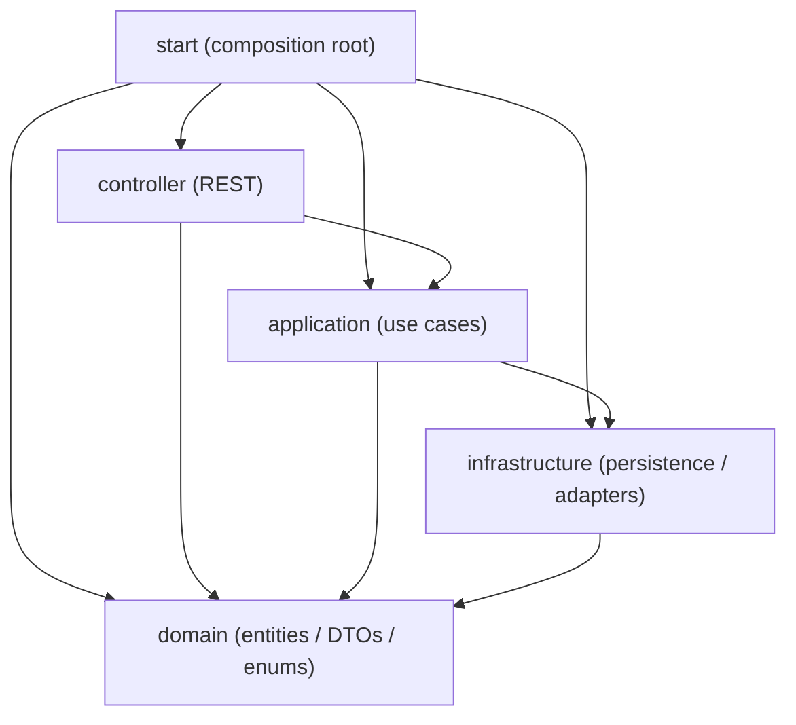
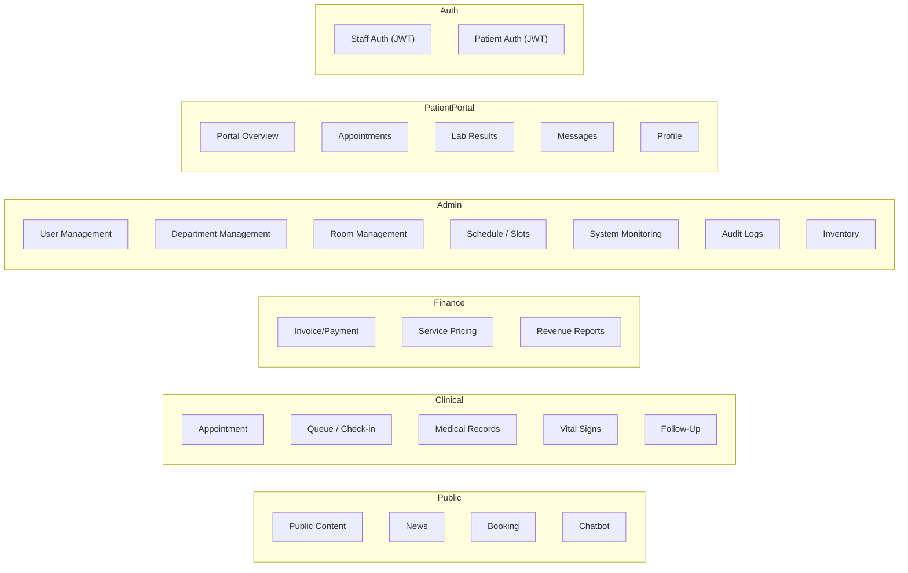
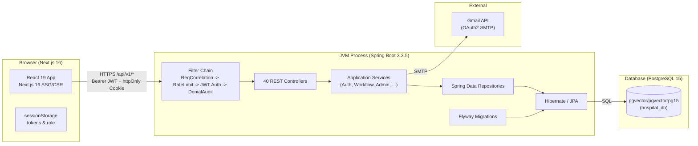
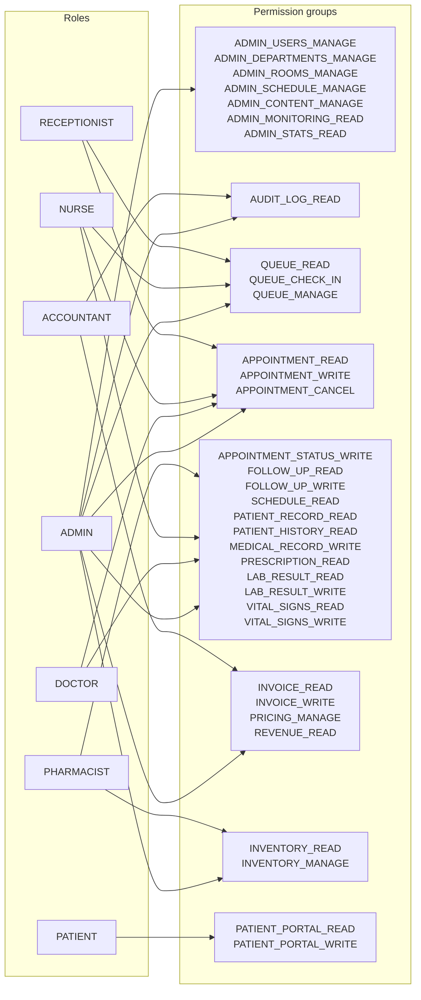
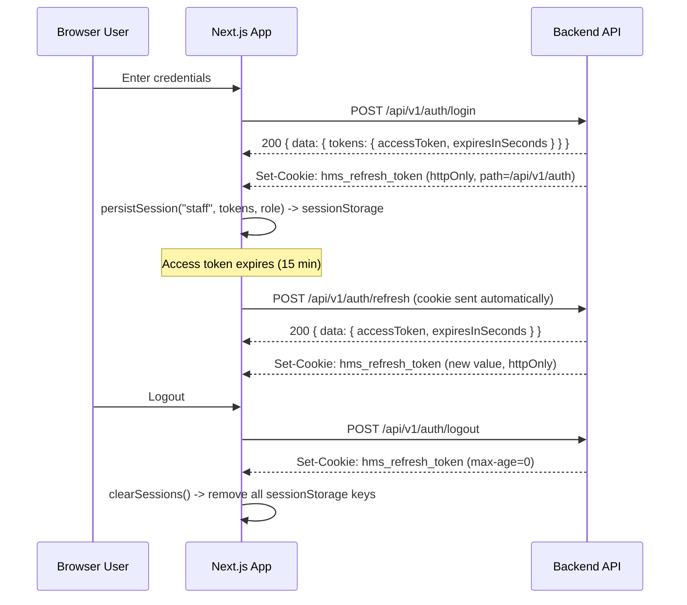
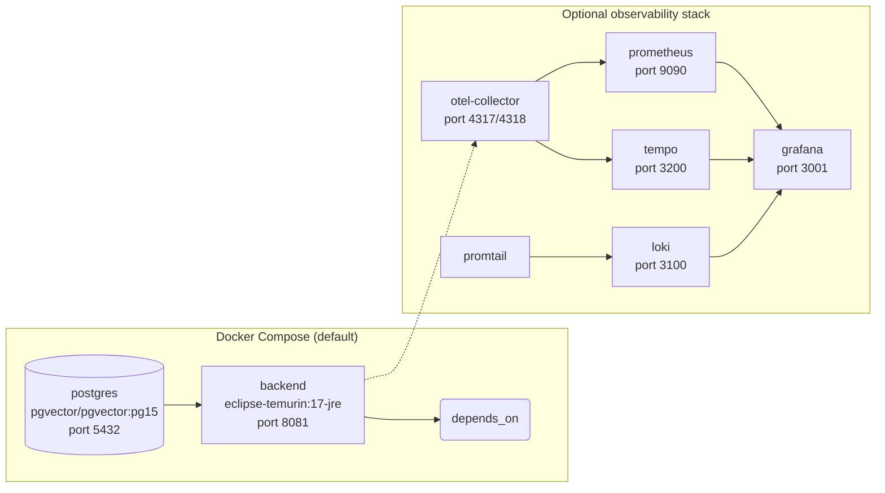

# Architecture -- Hospital Management System

- **Status:** living document; reflects codebase state as of 2026-06-14
- **Scope:** backend modular monolith, frontend integration, deployment topology

---

## Table of Contents

1. [Architecture Style Selection and Rationale](#1-architecture-style-selection-and-rationale)
2. [Module Responsibilities and Boundaries](#2-module-responsibilities-and-boundaries)
3. [Dependency Rules and Enforcement Strategy](#3-dependency-rules-and-enforcement-strategy)
4. [Component Diagram](#4-component-diagram)
5. [Key Design Decisions](#5-key-design-decisions)
6. [Integration Patterns Between Modules](#6-integration-patterns-between-modules)
7. [Frontend-Backend Integration Pattern](#7-frontend-backend-integration-pattern)
8. [Deployment Architecture](#8-deployment-architecture)

---

## 1. Architecture Style Selection and Rationale

### Decision: Modular Monolith

HMS adopts a **DDD-oriented modular monolith** delivered via a five-module Maven reactor. This is a deliberate rejection of both a single-fat-JAR monolith and a microservices decomposition.

### Rationale (why not microservices)

| Concern | Microservices cost | Why HMS mitigates it with a modular monolith |
|---|---|---|
| Network latency | Every cross-service call adds 1-5 ms | All calls are in-process; no serialization overhead |
| Distributed transactions | Sagas or two-phase commit add complexity | Single database, @Transactional across bounded contexts |
| Operational burden | N services need N deployments, N health checks, N log streams | One deployment artifact, one process |
| Debugging | Trace propagation across services requires OpenTelemetry | Single-process profiling, thread dumps, and debugger work immediately |
| Data consistency | Eventual consistency complicates appointment/ inventory logic | ACID transactions for financial and clinical workflows |
| Team scale | 4-8 developers (current team) do not need independent deploy cadences | Single deploy pipeline is sufficient |

### When migration to microservices could be considered

If the team grows beyond 12 developers AND two or more bounded contexts show independent release cycles, the module boundaries are already correct extraction points -- each Maven module maps naturally to a microservice skeleton. The `domain` module would become a shared library, and `infrastructure`/`application`/`controller` would become per-service modules.

### CQRS: Deliberately Not Applied

The architecture does **not** implement Command Query Responsibility Segregation. Rationale:

- Every read path in the current application hits the same JPA entities and Spring Data repositories that serve writes.
- No read model has yet shown performance degradation that would justify a separate query path.
- The read load is well within a single PostgreSQL 15 instance's capacity (the busiest page, the queue board, renders sub-100 records).
- Introducing CQRS would add event-publishing infrastructure and eventual-consistency complexity with no measurable benefit at the current scale.

---

## 2. Module Responsibilities and Boundaries

### Module Dependency Graph



### Module table

| Module | Artifact ID | Responsibility | Key packages |
|---|---|---|---|
| `domain` | `domain` | Persistent JPA entities, enums, request/response DTOs, domain exceptions | `com.hospital.core.*` (entities), `com.hospital.shared.*` (DTOs/enums) |
| `infrastructure` | `infrastructure` | Spring Data JPA repositories, external adapter implementations (Gmail, PDF generation), patient identifier crypto | `com.hospital.core.*` (repositories, services) |
| `application` | `application` | Use-case orchestration services, auth/token services, RBAC authorization, seed/backfill jobs, scheduled reminders | `com.hospital.core.*` (services), `com.hospital.api.auth` |
| `controller` | `controller` | REST controllers, API response envelope (`ApiResponse`), Spring Security filter chain, web exception handler, SpringDoc/OpenAPI | `com.hospital.api.*` (controllers), `com.hospital.api.config`, `com.hospital.api.shared` |
| `start` | `start` | Spring Boot main class, runtime properties (`application.yml`), Flyway migrations, integration tests | `com.hospital.api` (HmsApiApplication), `db/migration` |

### Bounded context map



---

## 3. Dependency Rules and Enforcement Strategy

### Compile-time dependency rules (Maven POM)

Each module declares only the intra-project dependencies it is allowed to consume. The allowed set is enforced at two levels.

| Module | May depend on (Maven `<dependency>`) | Banned dependencies (Maven enforcer) |
|---|---|---|
| `domain` | _none_ | `infrastructure`, `application`, `controller`, `start` |
| `infrastructure` | `domain` | `application`, `controller`, `start` |
| `application` | `domain`, `infrastructure` | `controller`, `start` |
| `controller` | `domain`, `application` | `infrastructure`, `start` |
| `start` | `domain`, `infrastructure`, `application`, `controller` | _none_ |

### Enforcement mechanism

1. **Maven Enforcer Plugin** (`bannedDependencies` rule) -- fires at compile time. Each module's `pom.xml` carries an enforcer execution that bans modules it must not depend on, with `searchTransitive: false` so transitive escapes are caught too.

2. **`ModuleBoundaryTest`** (`start/src/test/java/.../ModuleBoundaryTest.java`) -- fires during `mvn verify`. This JUnit 5 test performs two checks:

   - **POM dependency check:** Reads each module's `pom.xml` and asserts that the set of `com.hospital` artifact IDs it declares matches the expected set exactly. For example, `domain` must have _zero_ intra-project dependencies, `infrastructure` must have exactly `domain`, etc.

   - **Source import check:** Scans every `.java` file in every module, extracts `import com.hospital.*` statements, resolves the imported type to its owning module, and asserts the import is in the allowed set. This catches cases where a developer adds a direct import that bypasses the POM dependency (e.g., `domain` code importing a `controller` class).

### Package naming convention

All modules use the `com.hospital` root. Sub-packages follow the pattern:

- `com.hospital.core.<bounded-context>` -- entities (domain), repositories (infrastructure), services (application)
- `com.hospital.api.<bounded-context>` -- controllers (controller), auth services (application)
- `com.hospital.shared.<bounded-context>` -- DTOs and enums (primarily in the `domain` module; `ApiResponse` lives in `controller`)

The `start` module scans `com.hospital` at runtime via `@SpringBootApplication(scanBasePackages = "com.hospital")`, `@EntityScan`, and `@EnableJpaRepositories`, so component scanning and JPA work across module JARs without explicit `@ComponentScan` configuration.

---

## 4. Component Diagram

### Runtime process architecture



### Controller inventory

40 REST controllers, 156 request-mapped methods, as of 2026-06-14.

| Area | Controller class | Request mappings | Base path |
|---|---|---|---|
| **Auth** | `AuthController` | 3 | `/api/v1/auth` |
| **Auth** | `PatientAuthController` | 3 | `/api/v1/patient-auth` |
| **Admin** | `AdminUserController` | 4 | `/api/v1/admin/users` |
| **Admin** | `AdminDepartmentController` | 4 | `/api/v1/admin/departments` |
| **Admin** | `AdminRoomController` | 4 | `/api/v1/admin/rooms` |
| **Admin** | `AdminScheduleTemplateController` | 3 | `/api/v1/admin/schedule-templates` |
| **Admin** | `AdminSpecialClosureController` | 3 | `/api/v1/admin/special-closures` |
| **Admin** | `AdminTimeSlotController` | 4 | `/api/v1/admin/slots` |
| **Admin** | `AdminStatsController` | 1 | `/api/v1/admin/stats` |
| **Admin** | `AdminMonitoringController` | 1 | `/api/v1/admin/monitoring` |
| **Admin** | `AdminAuditLogController` | 1 | `/api/v1/admin/audit-logs` |
| **Admin** | `AdminContentController` | 4 | `/api/v1/admin/content/sections` |
| **Admin** | `AdminPublicContentController` | 4 | `/api/v1/admin/public-content` |
| **Admin** | `AdminNewsController` | 4 | `/api/v1/admin/news` |
| **Clinical** | `AppointmentController` | 8 | `/api/v1/appointments` |
| **Clinical** | `QueueController` | 6 | `/api/v1/queue` |
| **Clinical** | `MedicalRecordController` | 5 | `/api/v1/medical-records` |
| **Clinical** | `VitalSignsController` | 4 | `/api/v1/vital-signs` |
| **Clinical** | `LabResultController` | 4 | `/api/v1/lab-results` |
| **Clinical** | `PatientRecordController` | 2 | `/api/v1/patient-records` |
| **Clinical** | `ScheduleController` | 2 | `/api/v1/me/schedule` |
| **Finance** | `InvoiceController` | 5 | `/api/v1/invoices` |
| **Finance** | `PricingController` | 3 | `/api/v1/pricing` |
| **Finance** | `RevenueReportController` | 4 | `/api/v1/revenue-reports` |
| **Inventory** | `InventoryController` | 11 | `/api/v1/inventory` |
| **Patient Portal** | `PatientPortalController` | 6 | `/api/v1/patient-portal` |
| **Public** | `PublicContentController` | 3 | `/api/v1/content` |
| **Public** | `DepartmentController` | 3 | `/api/v1/departments` |
| **Public** | `DoctorController` | 5 | `/api/v1/doctors` |
| **Public** | `PatientController` | 2 | `/api/v1/patients` |
| **Public** | `ChatbotController` | 1 | `/api/v1/chatbot` |
| **AI** | `AiIntegrationController` | 1 | `/api/v1/ai` |
| **Integration support** | `JwtAuthenticationFilter` | (filter) | all authenticated paths |
| **Integration support** | `RateLimitFilter` | (filter) | public POST endpoints |
| **Integration support** | `RequestCorrelationFilter` | (filter) | all paths |
| **Integration support** | `AuthorizationDenialAuditFilter` | (filter) | all paths |
| **Integration support** | `RestExceptionHandler` | (advice) | all paths |
| **Integration support** | `SecurityConfig` | (config) | chain wiring |
| **Integration support** | `SecurityErrorResponseWriter` | (helper) | error serialization |

### Filter chain order

```text
RequestCorrelationFilter (highest precedence)
  -> AuthorizationDenialAuditFilter
    -> RateLimitFilter
      -> JwtAuthenticationFilter
        -> Controller dispatcher
```

### RBAC permission matrix

34 permission keys mapped to 7 user roles in `RbacAuthorizationService`.



---

## 5. Key Design Decisions

### 5.1 Domain-Driven Design (tactical patterns applied)

- **Entities:** Every `*Entity.java` class carries a `@Id` field (JPA `@Entity`) and is identity-tracked. Examples: `AppointmentEntity`, `PatientEntity`, `UserEntity`, `DepartmentEntity`.
- **Value objects:** Enums (`AppointmentStatus`, `UserRole`, `RoomStatus`, `SlotStatus`, `Gender`, `InvoiceStatus`) are modelled as Java enums in `com.hospital.shared.enums`.
- **Repositories:** Spring Data `JpaRepository` interfaces live in the `infrastructure` module. They are injected into application services, which are the sole callers.
- **Domain services:** Pure business logic that does not fit naturally on an entity (e.g., `RbacAuthorizationService`, `PatientIdentifierProtector`) lives in `application` or `infrastructure` depending on whether it depends on infrastructure concerns.
- **Aggregates:** The `AppointmentEntity` is the root of the clinical aggregate; `PatientEntity` is the root of the patient aggregate. Cross-aggregate references use foreign-key IDs rather than direct entity references where possible.

### 5.2 CQRS -- deliberately not applied

See [Section 1 -- CQRS rationale](#cqrs-deliberately-not-applied).

### 5.3 Why JWT (not session-based auth)

| Factor | JWT (chosen) | Session-based | Notes |
|---|---|---|---|
| Statelessness | Self-contained token; no server-side session store | Requires Redis or DB-backed session store | Eliminates a stateful dependency |
| Dual auth | Staff and patient flows both produce structurally identical JWTs with different `role` claims | Would require separate session configurations | Uniform token handling for both auth domains |
| Refresh model | Short-lived access token (15 min) + long-lived httpOnly refresh cookie (7 days) in a single endpoint + dedicated cookie path | Session-based refresh would require CSRF token management | Cookie-based refresh reduces XSS surface |
| Scalability | No session affinity needed; any instance can validate any JWT | Session affinity limits horizontal scaling | Important for future multi-instance deployments |

The JWT library is JJWT (io.jsonwebtoken) 0.12.6. The signing key is derived from a configured `JWT_SECRET` environment variable (HMAC-SHA with 256+ bit key). Access tokens carry `sub` (user UUID), `role`, and `name` claims. Refresh tokens carry `sub`, `type: "refresh"`, and `scope: "staff"|"patient"`.

### 5.4 Why pgvector image is kept (but vector features removed)

The database image is `pgvector/pgvector:pg15` even though migration `V11` removed all vector-extension usage (assistant knowledge tables, embedding columns, and the `vector` extension itself). Rationale:

- Migration `V11` issues `DROP EXTENSION IF EXISTS vector` but does not change the base image. The `pgvector` image is a standard PostgreSQL 15 build that runs `CREATE EXTENSION vector` by default only when requested. Without the extension, it behaves as a regular PostgreSQL 15 instance.
- Changing the image to `postgres:15` provides no operational benefit and would require updating the CI/CD pipeline, Docker Compose files, and developer documentation for zero gain.
- Keeping the `pgvector` image avoids an unnecessary infrastructure change and preserves the option to reintroduce vector capabilities without a database migration.

### 5.5 Patient identifier protection: AES-GCM + SHA-256

Patient identifiers (Vietnamese CCCD/citizen ID numbers) receive two layers of cryptographic protection:

| Layer | Algorithm | Purpose | Implementation |
|---|---|---|---|
| Encryption | AES-256-GCM with random 12-byte IV | Protects the identifier at rest in the database | `PatientIdentifierProtector.encrypt()` produces `enc:<base64url(iv + ciphertext)>` |
| Hashing | SHA-256 | Enables equality lookup without exposing the plain identifier | `PatientIdentifierProtector.hash()` produces a hex string stored as `cccdHash` |

The encryption key is derived from the `PATIENT_IDENTIFIER_SECRET` environment variable via SHA-256 key derivation. The `enc:` prefix allows the system to distinguish encrypted values from plain values (supporting a migration window).

### 5.6 Dual authentication: staff + patient

Two independent auth domains share the same JWT infrastructure but diverge in identity stores and refresh scope.

| Concern | Staff auth | Patient auth |
|---|---|---|
| Identity store | `UserEntity` + `UserRepository` (staff users) | `PatientAccountEntity` + `PatientAccountRepository` (patient-facing accounts) |
| Login endpoint | `POST /api/v1/auth/login` | `POST /api/v1/patient-auth/login`, `POST /api/v1/patient-auth/claim` |
| Refresh scope | `scope: "staff"` | `scope: "patient"` |
| Refresh cookie | `hms_refresh_token` | `hms_refresh_token_patient` |
| Role claim | `ADMIN`, `DOCTOR`, `NURSE`, `RECEPTIONIST`, `ACCOUNTANT`, `PHARMACIST` | `PATIENT` |
| Token validation | Same JJWT parser, same signing key | Same JJWT parser, same signing key |
| RBAC permission set | 33 permissions mapped across 6 staff roles | 2 permissions: `PATIENT_PORTAL_READ`, `PATIENT_PORTAL_WRITE` |

The claim flow (`POST /patient-auth/claim`) is a patient self-registration step where the system verifies identity by matching email + date of birth + full name + CCCD hash against an existing `PatientEntity` (created during hospital registration). On successful verification, a `PatientAccountEntity` is created.

### 5.7 API response envelope

Every REST endpoint returns a consistent envelope type `ApiResponse<T>`:

```json
{
  "success": true,
  "data": { ... },
  "message": "Request completed successfully",
  "error": null,
  "pagination": { "total": 100, "page": 1, "limit": 20 },
  "timestamp": "2026-06-14T12:00:00Z"
}
```

Error responses follow the same shape with `success: false`, `data: null`, and `error: { "code": "...", "message": "..." }`.

---

## 6. Integration Patterns Between Modules

### 6.1 Spring-component wiring

All modules share the `com.hospital` package root. The `start` module's `@SpringBootApplication(scanBasePackages = "com.hospital")` causes Spring to discover `@Component`, `@Service`, `@Repository`, and `@Configuration` beans across all five JARs. This is the only cross-module integration mechanism. There is no module-internal event bus, no OSGi-style service registry, and no inter-module RPC.

### 6.2 Transaction boundaries

`@Transactional` annotations appear on application-service methods. Because the single `start` module boots a `LocalContainerEntityManagerFactoryBean` (via `@EnableJpaRepositories`), Spring manages a single `PlatformTransactionManager` that spans all modules. A service in `application` can call repositories in `infrastructure` that operate on entities defined in `domain`, all within the same JDBC transaction.

### 6.3 Cross-module data flow

```text
controller (DTO)
  -> application service method
    -> infrastructure repository method
      -> domain entity (JPA managed)
```

Return values flow back through the same layers. Controllers translate domain/DTO objects into `ApiResponse<T>` envelopes. Services never return `ApiResponse` objects -- they return domain objects or DTOs, and the controller wraps them.

### 6.4 Exception propagation

Domain exceptions (`NotFoundException`, `ConflictException`) defined in the `domain` module extend `RuntimeException`. They propagate through `application` and `controller` uncaught until they reach `RestExceptionHandler` (a `@RestControllerAdvice` in the `controller` module), which maps them to appropriate HTTP status codes in the `ApiResponse` envelope format.

External integration exceptions (e.g., Gmail API failures) are caught in `infrastructure` adapters and wrapped in `RuntimeException` subclasses or `IllegalStateException` before reaching the service layer.

### 6.5 Scheduled tasks

`ReminderService` in the `application` module uses Spring's `@Scheduled` annotation. It queries repositories in `infrastructure`, applies business logic, and triggers email delivery via the `EmailService` in `infrastructure`. Scheduling configuration is enabled by `@EnableScheduling` in the `start` module.

---

## 7. Frontend-Backend Integration Pattern

### 7.1 Application layer

The frontend is a **Next.js 16** application using the **App Router** (`frontend/src/app`), React 19, Tailwind CSS 4, and Base UI components. It communicates with the backend exclusively through the REST API at `/api/v1/*`.

### 7.2 API client architecture

```text
Page / Component
  -> Feature service module (frontend/src/lib/*.ts)
    -> apiRequest(path, init, { authScope })
      -> fetch(`${apiBaseUrl}${path}`, { credentials: "include", headers })
        -> Spring Boot controller
```

The shared `apiRequest` function in `frontend/src/lib/api-client.ts` handles:

1. **Base URL resolution:** reads `NEXT_PUBLIC_API_BASE_URL` environment variable; defaults to `http://localhost:8081/api/v1`.
2. **Content negotiation:** always sets `Content-Type: application/json` and `Accept: application/json`.
3. **Auth token injection:** reads the access token from `sessionStorage` keyed by auth scope (`hms_staff_access_token` or `hms_patient_access_token`) and attaches it as `Authorization: Bearer <token>`.
4. **Cookie support:** always sends `credentials: "include"` so the httpOnly refresh cookie is sent with every request.
5. **Request ID propagation:** generates or forwards `X-Request-Id` for end-to-end request correlation.
6. **Response parsing:** decodes the `ApiEnvelope<T>` and throws `ApiClientError` for non-2xx responses.
7. **Browser-only metrics:** dispatches a `CustomEvent("hms:api-request")` for observability tooling.

### 7.3 Authentication flow



The same pattern applies to the patient auth flow using `/api/v1/patient-auth/login` and the `patient` scope.

### 7.4 Service module organization

| Module file | Business surface | Base path |
|---|---|---|
| `public-api.ts` | Doctors, departments, public booking | `/departments`, `/doctors`, `/appointments` |
| `clinical-api.ts` | Queue, appointment list, check-in | `/queue`, `/appointments` |
| `medical-records-api.ts` | Medical record CRUD | `/medical-records` |
| `patient-records-api.ts` | Staff patient search/detail | `/patient-records` |
| `operations-api.ts` | Inventory, finance, admin, portal | `/inventory`, `/invoices`, `/admin/*`, `/patient-portal/*` |
| `rbac.ts` | Frontend route guard decisions | (computed) |
| `staff-queue.ts` | Queue-specific derived state | (computed) |

### 7.5 State management

The frontend does **not** use Redux, Zustand, React Query, or Axios. State is managed as follows:

| State category | Mechanism | Example |
|---|---|---|
| Server data | Page-local `useState` + `useEffect` fetches | Queue board appointments list |
| Auth tokens | `sessionStorage` (staff and patient, separate keys) | `hms_staff_access_token` |
| UI state | Page-local `useState`, `useMemo` | `isSubmitting`, `isSaving`, derived filters |
| Navigation | Shared shell components + RBAC filters | Side nav, top nav, mobile nav |

### 7.6 Token refresh handling

The backend supports token refresh on both auth paths. The frontend does **not** currently implement an automatic response interceptor that retries 401 responses by refreshing the token and replaying the original request. This is a known gap documented in `FRONTEND_ARCHITECTURE.md`. When the access token expires, the user sees a 401 error from the API, which should trigger a redirect to the login page or a manual refresh call.

---

## 8. Deployment Architecture

### 8.1 Container topology



### 8.2 Service specifications

| Service | Image base | Exposed port | Dependencies |
|---|---|---|---|
| `postgres` | `pgvector/pgvector:pg15` | `5432` | (none) |
| `backend` | `eclipse-temurin:17-jre` (built via multi-stage Maven build) | `8081` (API), `8082` (management) | postgres (health check) |
| `frontend` | `node:22-alpine` standalone Next.js server | `3000` | backend |

### 8.3 Build artifacts

**Backend:** The Docker build uses a multi-stage Dockerfile:
1. **Build stage:** `maven:3.9.9-eclipse-temurin-17` compiles the entire reactor with `mvn -q -pl start -am package -DskipTests`.
2. **Runtime stage:** `eclipse-temurin:17-jre` receives the fat JAR (`start-0.1.0-SNAPSHOT.jar`) plus `fontconfig` and `fonts-dejavu-core` for PDF generation.

**Frontend:** A `node:22-alpine` build produces a standalone Next.js build (`next build`) with static and server-rendered pages.

### 8.4 Environment configuration

The backend is configured entirely through environment variables. Key groups:

| Group | Variables | Purpose |
|---|---|---|
| Database | `POSTGRES_*` | JDBC connection string and credentials |
| JWT | `JWT_SECRET` | HMAC signing key for token issuance |
| Patient identifier | `PATIENT_IDENTIFIER_SECRET` | AES-GCM encryption key for PHI |
| CORS | `HMS_ALLOWED_ORIGIN_*`, `HMS_ALLOW_CREDENTIALS` | Cross-origin policy for browser clients |
| Rate limiting | `HMS_PUBLIC_RATE_LIMIT_PER_MINUTE` | Public endpoint rate cap (default 30/min) |
| Email | `GMAIL_*` | Google API OAuth2 SMTP integration |
| Seed data | `HMS_RELEASE_DEMO_*` | Demo data generation on startup |
| Observability | `MANAGEMENT_*`, `OTEL_*` | Prometheus metrics, OTLP tracing, structured logging |

Secrets (`JWT_SECRET`, `POSTGRES_PASSWORD`, `PATIENT_IDENTIFIER_SECRET`) are mandatory at startup. Missing secrets cause the Spring context to fail to initialize.

### 8.5 Observability stack (optional)

Activated via `docker compose -f docker-compose.yml -f docker-compose.observability.yml up`.

| Component | Role |
|---|---|
| **OpenTelemetry Collector** | Receives OTLP traces and metrics from the backend, routes to Tempo and Prometheus |
| **Prometheus** | Scrapes `/actuator/prometheus` for HTTP metrics (percentile latencies, request counts, rate-limit rejections) |
| **Grafana** | Dashboards for metrics, traces, and logs; pre-provisioned datasources for Prometheus, Tempo, and Loki |
| **Tempo** | Distributed trace storage (trace ID propagation via `X-Request-Id` and W3C traceparent) |
| **Loki + Promtail** | Log aggregation (structured JSON logs via logstash-logback-encoder) |

The backend exposes:
- `GET /actuator/health` (liveness + readiness probes)
- `GET /actuator/prometheus` (Prometheus scrape endpoint)
- OTLP traces via `Micrometer Tracing Bridge` (logged to console in absence of OTLP endpoint)

### 8.6 CI/CD pipeline

Defined in `.github/workflows/ci.yml` (continuous integration) and `.github/workflows/cd.yml` (continuous delivery to GitHub Container Registry). The CI pipeline runs:

1. `mvn verify` (unit tests, integration tests with Testcontainers, JaCoCo coverage, module boundary checks)
2. Frontend `npm ci` + `npm run lint` + `npm run typecheck` + `npm test`
3. Docker image build and push (on merge to master)

---

## Appendix A: Technology Stack Summary

| Layer | Technology | Version |
|---|---|---|
| Language (backend) | Java | 17 |
| Framework (backend) | Spring Boot | 3.3.5 |
| ORM | Hibernate / Spring Data JPA | 6.x (Spring Boot 3.3 managed) |
| Database | PostgreSQL (via pgvector image) | 15 |
| DB migration | Flyway | (Spring Boot 3.3 managed) |
| JWT library | JJWT | 0.12.6 |
| PDF generation | Apache PDFBox | 3.0.4 |
| API documentation | SpringDoc OpenAPI | 2.6.0 |
| Runtime (backend) | Eclipse Temurin JRE | 17 |
| Build tool | Maven | 3.9.9 |
| Code coverage | JaCoCo | 0.8.12 |
| Test (backend) | JUnit 5, Mockito, Testcontainers, Spring Boot Test | (latest stable) |
| Language (frontend) | TypeScript | (Next.js 16 managed) |
| Framework (frontend) | Next.js | 16 |
| UI library | React | 19 |
| Styling | Tailwind CSS | 4 |
| UI primitives | Base UI | (latest) |
| Icons | Lucide React | (latest) |
| Test (frontend) | Vitest, React Testing Library, Playwright | (latest stable) |
| Container runtime | Docker Compose | (latest) |
| Observability | Micrometer, OpenTelemetry, Prometheus, Grafana, Tempo, Loki | (latest stable) |

## Appendix B: Database Schema Inventory

20 Flyway migrations from `V1` through `V20` define the schema:

| Migration | Key tables/columns added |
|---|---|
| V1 | departments, users, slots, patients, appointments, medical records, prescriptions, invoices, pricing |
| V2 | Clinical workflow columns |
| V3 | Patient email, follow-up scheduling |
| V4 | Patient identifier encryption columns |
| V5 | Content sections, news articles, operations foundation |
| V6 | Room operational flags, schedule templates, special closures |
| V7 | Inventory items, lots, movements |
| V8 | Patient portal tables (accounts, lab results, messages) |
| V9-V10 | (removed) Internal assistant knowledge tables |
| V11 | Removes AI assistant tables and vector extension |
| V12 | Follow-up appointments table |
| V13 | Appointment vital signs table |
| V14 | Appointment notes and reason metadata |
| V15 | Lab result columns for clinical + portal entities |
| V16 | User role constraint expansion for RBAC |
| V17 | Inventory quantity constraints |
| V18 | Invoice status constraint alignment |
| V19 | Pharmacy dispense traceability |
| V20 | Email delivery attempt tracking |

## Appendix C: Bounded Contexts and Their Entities

| Bounded Context | JPA Entities | Domain DTOs |
|---|---|---|
| **Appointment** | `AppointmentEntity`, `AppointmentVitalSignsEntity`, `FollowUpEntity` | `AppointmentDetailResponse`, `AppointmentListResponse`, `ClinicalAppointmentResponse`, `FollowUpRequest/Response`, `VitalSignsRequest/Response` |
| **Booking** | (uses AppointmentEntity) | `AppointmentCreateRequest`, `AppointmentResponse`, `BookingContactRequest`, `PatientAddressRequest` |
| **Patient** | `PatientEntity` | (various) |
| **Patient Auth** | `PatientAccountEntity` | `PatientAuthLoginResponse`, `PatientClaimRequest` |
| **Patient Portal** | `PatientMessageEntity`, `PatientMessageThreadEntity` (portal lab results use `LabResultEntity`) | `PatientPortal*Response` |
| **Medical Record** | `MedicalRecordEntity` | `MedicalRecordCreateRequest/Response`, `PatientHistoryResponse`, `PrescriptionItemPayload`, `VitalSignsPayload` |
| **Prescription** | `PrescriptionItemEntity` | (PDF generation only) |
| **Department** | `DepartmentEntity` | `DepartmentResponse`, `DepartmentDetailResponse` |
| **Doctor** | (uses UserEntity with DOCTOR role) | `DoctorResponse`, `DoctorSlotResponse` |
| **Time Slot** | `TimeSlotEntity` | (used by booking/admin) |
| **Room** | `RoomEntity` | `AdminRoomResponse` |
| **Schedule Template** | `DoctorScheduleTemplateEntity` | `DoctorScheduleTemplateResponse` |
| **Special Closure** | `SpecialClosureEntity` | `SpecialClosureResponse` |
| **User** | `UserEntity` | `AdminUserResponse` |
| **Audit** | `AuditLogEntity` | `AuditLogResponse` |
| **Content** | `HospitalContentSectionEntity`, `NewsArticleEntity` | `HospitalContentSectionResponse`, `NewsArticleResponse`, `HomePageContentResponse` |
| **Invoice** | `InvoiceEntity`, `ServicePricingEntity` | `InvoiceResponse`, `ServicePricingResponse`, `RevenueReportResponse` |
| **Inventory** | `InventoryItemEntity`, `InventoryLotEntity`, `InventoryMovementEntity` | `InventoryItemResponse`, `InventoryLotResponse`, `InventoryMovementResponse`, `InventoryAlertResponse` |
| **Lab** | `LabResultEntity` | `LabResultCreateRequest/Response` |
| **Vital Signs** | (uses AppointmentVitalSignsEntity) | `VitalSignsCreateRequest/Response/UpdateRequest` |
| **Queue** | (uses AppointmentEntity status transitions) | `QueueRoomAssignmentRequest` |
| **Email** | `EmailDeliveryAttemptEntity` | (internal) |

---

*Generated for the Hospital Management System project. Updates to this document should be reflected in `ModuleBoundaryTest` when dependency rules change, and vice versa.*
