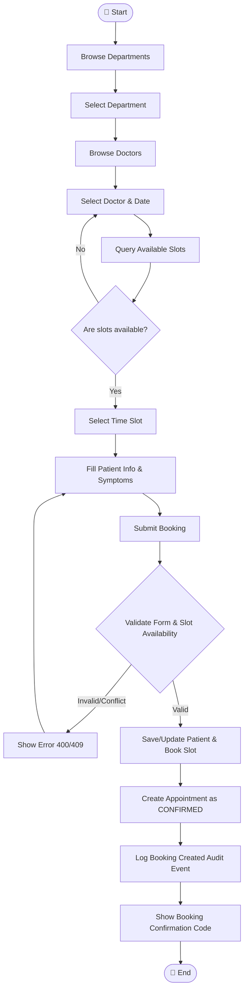
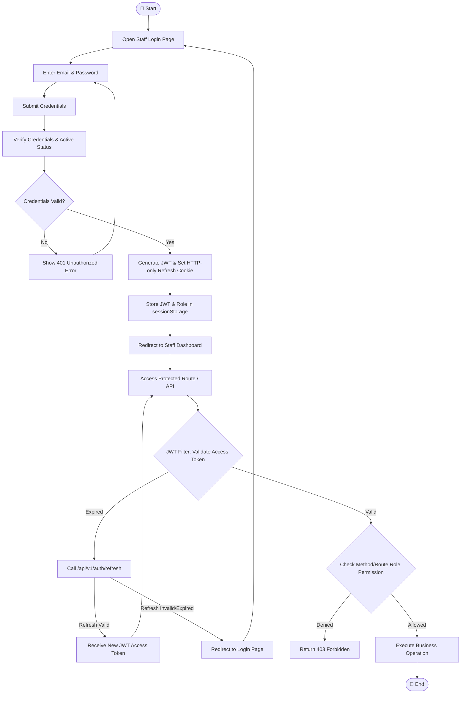
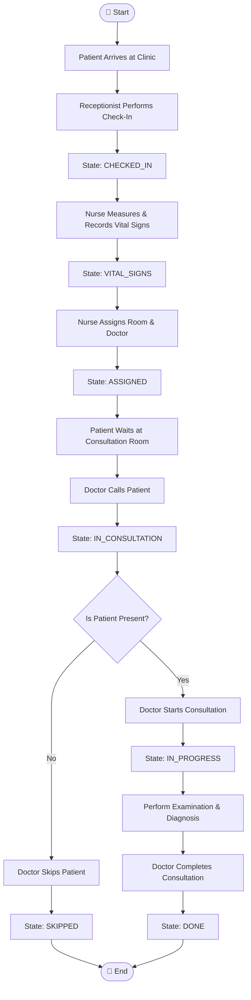
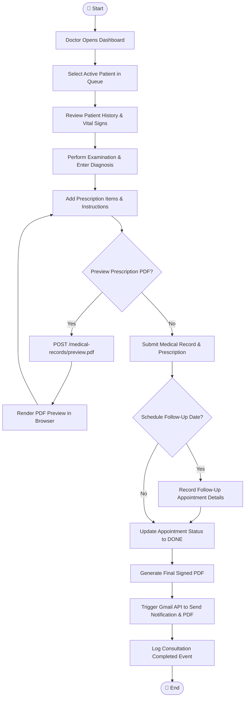
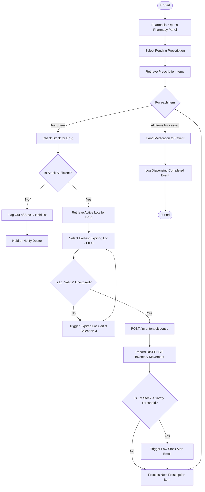
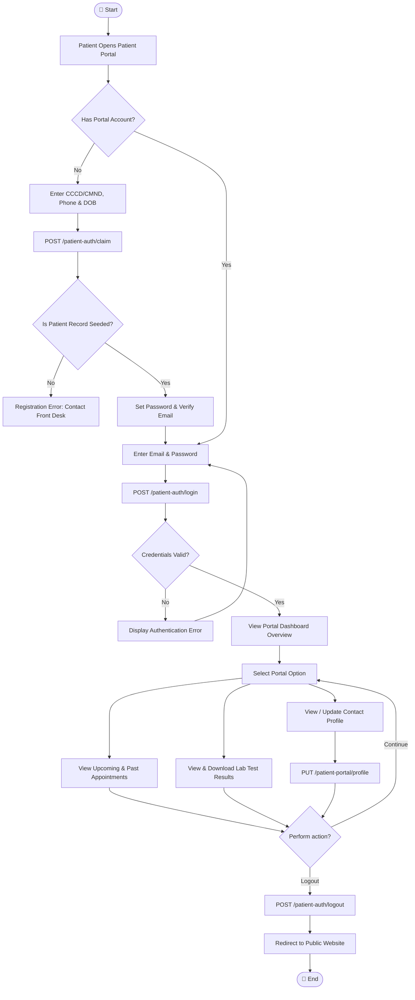

# End-to-End Business Flow Activity Diagrams

This document details the activity flows (workflows) for the 7 core end-to-end clinical and administrative processes of the Hospital Management System.

---

## Flow 1: Public Booking



---

## Flow 2: Staff Authentication



---

## Flow 3: Queue Operations



---

## Flow 4: Doctor Clinical



---

## Flow 5: Pharmacy Dispense



---

## Flow 6: Billing

```mermaid
flowchart TD
    Start([🏁 Start]) --> ConsultationDone[Consultation / Services Completed]
    ConsultationDone --> CreateInvoice[POST /api/v1/invoices]
    CreateInvoice --> StateUnpaid[State: UNPAID]
    StateUnpaid --> PatientBilling[Patient Arrives at Billing Counter]
    PatientBilling --> PresentInvoice[Accountant Presents Invoice]
    PresentInvoice --> PaymentChoice{Does Patient Pay?}
    PaymentChoice -- Yes --> RecordPayment[POST /invoices/{id}/payments]
    RecordPayment --> StatePaid[State: PAID]
    RecordPayment --> PrintReceipt[Generate Payment Receipt PDF]
    PaymentChoice -- No / Dispute --> VoidInvoice[POST /invoices/{id}/void]
    VoidInvoice --> StateCancelled[State: CANCELLED]
    StatePaid --> ViewReports[Admin Accesses Revenue Reports]
    StateCancelled --> ViewReports
    ViewReports --> QueryReports[GET /reports/revenue/daily or monthly]
    QueryReports --> RenderAnalytics[Render Revenue Charts & Financial Dashboards]
    RenderAnalytics --> End([🏁 End])
```

---

## Flow 7: Patient Portal


