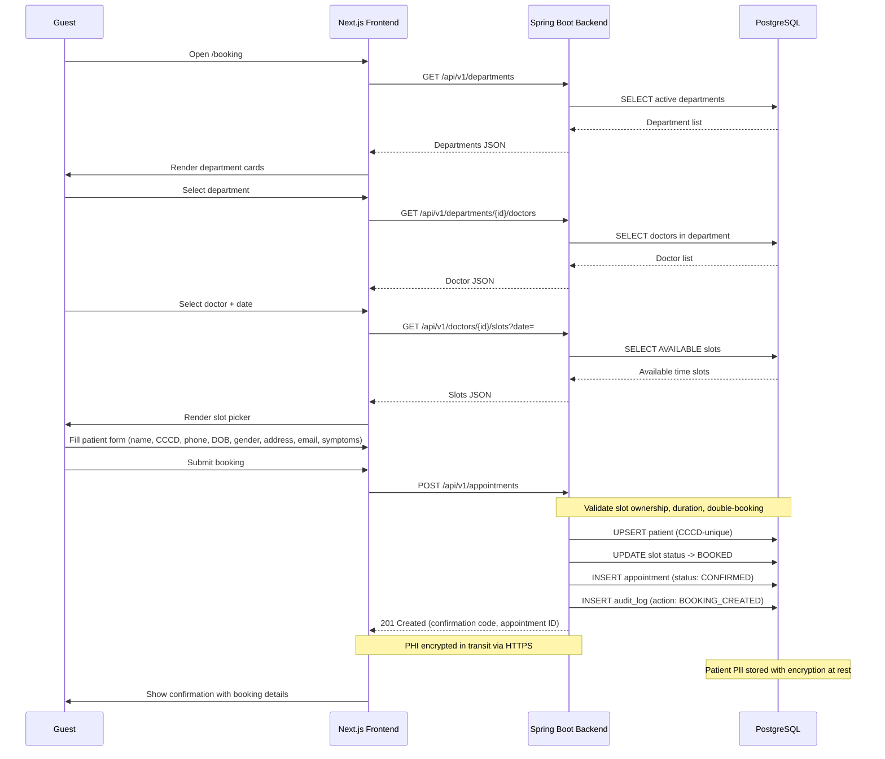
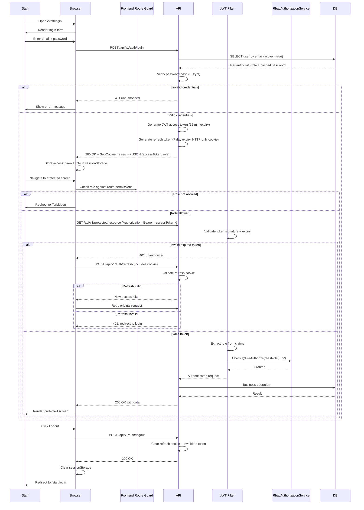
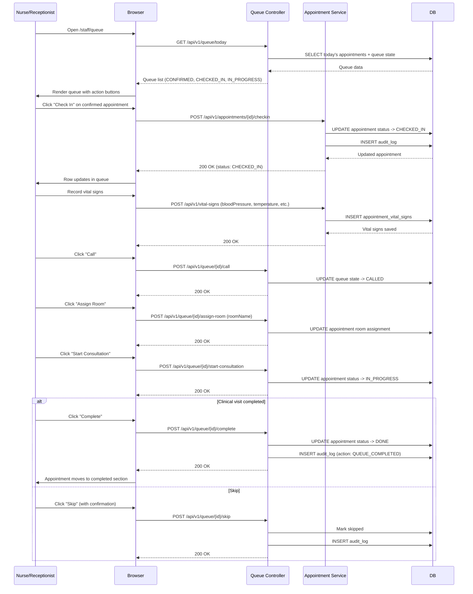
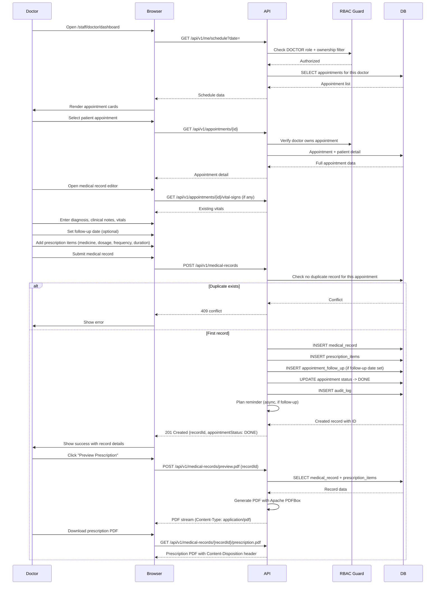
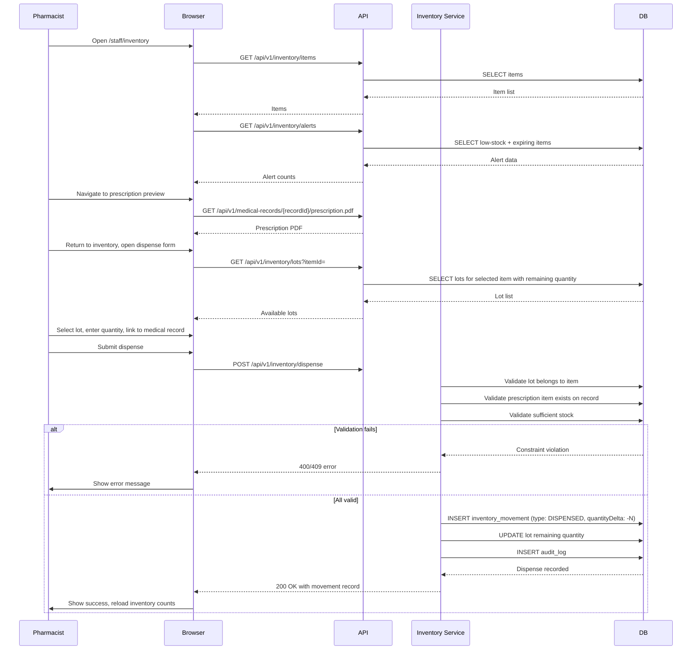
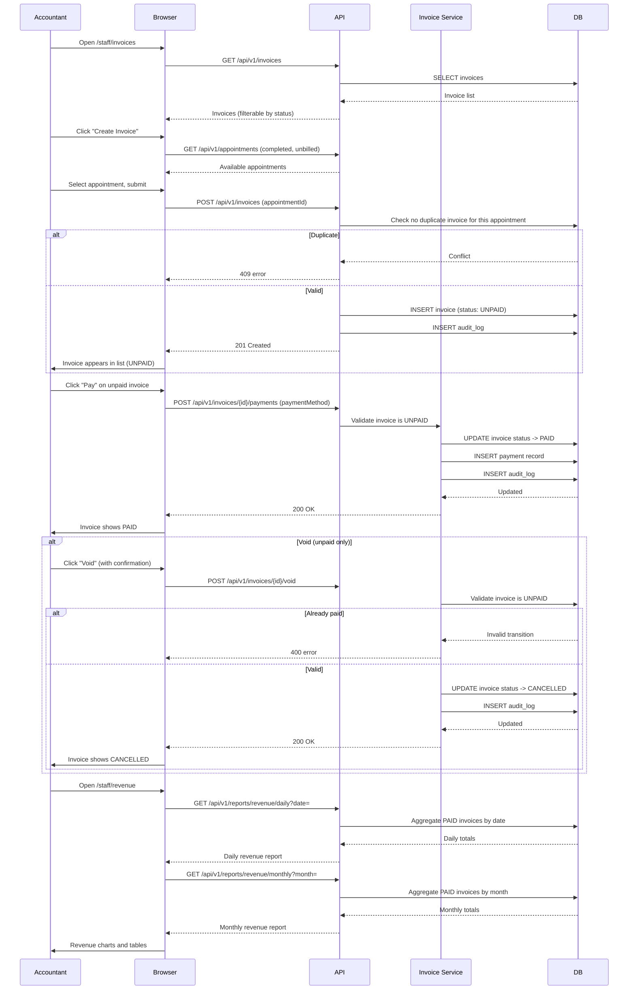
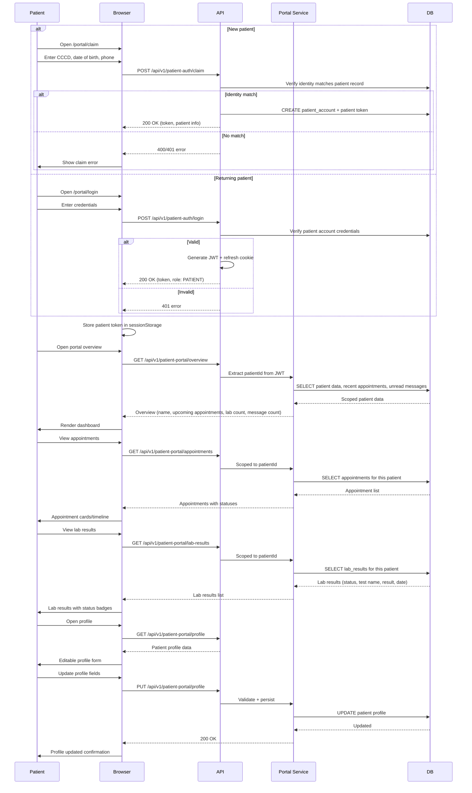

# End-to-End Business Flows

**Version:** 1.0
**Date:** 2026-06-14
**Scope:** All 7 clinical workflows in the Hospital Management System

---

## Flow 1: Public Booking (Guest)

**Business Objective:** Allow a guest (unauthenticated user) to browse hospital information, select a doctor and available slot, submit patient identity and symptoms, and receive a confirmed appointment with encrypted PHI.

**Actors:** Guest, Backend API, Database

**APIs Involved:**
- `GET /api/v1/departments` — list departments
- `GET /api/v1/departments/{id}/doctors` — doctors by department
- `GET /api/v1/doctors/{id}/slots?date=` — available slots
- `POST /api/v1/appointments` — create appointment

**Data Created/Updated:** `patients`, `appointments`, `time_slots` (AVAILABLE -> BOOKED), `audit_logs`

**State Transitions:** Appointment created as `CONFIRMED`; slot moves `AVAILABLE -> BOOKED`

**Exception Flows:**
- Missing required fields -> backend returns 400 `validation_error`
- Slot already BOOKED or BLOCKED -> backend returns 409 `conflict`
- Duplicate concurrent booking -> database constraint or optimistic lock
- Network disconnect -> loading state with retry

---

## Flow 2: Staff Authentication (Login -> JWT + Refresh Cookie -> RBAC)

**Business Objective:** Authenticate staff users via email/password, issue short-lived JWT and HTTP-only refresh cookie, enforce role-based access control (RBAC) across all protected routes and APIs.

**Actors:** Staff (Admin, Doctor, Nurse, Receptionist, Pharmacist, Accountant), JWT Filter, RbacAuthorizationService

**APIs Involved:**
- `POST /api/v1/auth/login` — authenticate, return tokens
- `POST /api/v1/auth/refresh` — refresh access token
- `POST /api/v1/auth/logout` — invalidate session
- All protected APIs through JWT filter + RBAC

**Data:** `users` (active check), `audit_logs` (denial/security events)

**Security Model:**
- Access token: short-lived JWT stored in sessionStorage
- Refresh token: HTTP-only cookie, not accessible to JavaScript
- Backend: JwtAuthenticationFilter validates token on every request
- Backend: RbacAuthorizationService enforces method-level @PreAuthorize
- Frontend: Route guard in `frontend/src/lib/rbac.ts` enforces screen-level access

---

## Flow 3: Queue Operations (Check-In -> Vitals -> Room -> Consultation -> Complete/Skip)

**Business Objective:** Move confirmed appointments through the operational queue: nurse/receptionist checks in the patient, records vitals, assigns a room, and either completes or skips the visit. Doctors start and complete consultations.

**Actors:** Nurse, Receptionist, Doctor, Admin

**APIs Involved:**
- `GET /api/v1/queue/today` — today's queue state
- `GET /api/v1/appointments/today` — today's appointments
- `POST /api/v1/appointments/{id}/checkin` — check in patient
- `POST /api/v1/queue/{id}/call` — call patient
- `POST /api/v1/queue/{id}/assign-room` — assign room
- `POST /api/v1/queue/{id}/start-consultation` — start consultation
- `POST /api/v1/queue/{id}/complete` — complete visit
- `POST /api/v1/queue/{id}/skip` — skip patient
- Vital sign endpoints

**Data:** `appointments`, `appointment_vital_signs`, `audit_logs`, `rooms`

**State Transitions:**
- Appointment: `CONFIRMED -> CHECKED_IN -> IN_PROGRESS -> DONE` (or `CANCELLED`/`SKIPPED`)

**Guards and Business Rules:**
- Check-in requires appointment in `CONFIRMED` status
- Start consultation requires appointment in `CHECKED_IN` or after room assignment
- Complete requires appointment in `IN_PROGRESS`
- Skip and Complete are terminal actions requiring confirmation
- Doctor cannot complete directly via status API when queue workflow is active (returns 409)

---

## Flow 4: Doctor Clinical (Dashboard -> Patient -> Record -> Prescription PDF -> Follow-Up)

**Business Objective:** Enable doctors to see their schedule, open a patient appointment, record diagnosis/notes/vitals/prescriptions, generate a prescription PDF, set follow-up reminders, and mark the appointment complete.

**Actors:** Doctor, Admin

**APIs Involved:**
- `GET /api/v1/appointments` — doctor's appointments
- `GET /api/v1/appointments/{id}` — appointment detail
- `GET /api/v1/me/schedule?date=` — doctor's schedule
- `PUT /api/v1/appointments/{id}/status` — update appointment status
- `POST /api/v1/medical-records` — create medical record
- `POST /api/v1/medical-records/preview.pdf` — preview prescription PDF
- `GET /api/v1/medical-records/{recordId}/prescription.pdf` — download PDF

**Data:** `medical_records`, `prescription_items`, `appointments`, `appointment_follow_ups`, `audit_logs`

**Guard:** Doctor can only access own appointments (enforced by `RbacAuthorizationService`)

---

## Flow 5: Pharmacy Dispense (View Rx -> Check Inventory -> Dispense -> Record Movement)

**Business Objective:** Let pharmacists view prescription items from medical records, check inventory stock, dispense medication against a valid prescription and stocked lot, and record the inventory movement.

**Actors:** Pharmacist, Admin

**APIs Involved:**
- `GET /api/v1/inventory/items` — list inventory items
- `GET /api/v1/inventory/lots` — list lots
- `POST /api/v1/inventory/dispense` — dispense medication
- `GET /api/v1/inventory/movements` — list movements
- `GET /api/v1/inventory/alerts` — low stock / expiry alerts
- `GET /api/v1/medical-records/{recordId}/prescription.pdf` — prescription PDF

**Data:** `inventory_items`, `inventory_lots`, `inventory_movements`, `medical_records`, `prescription_items`, `audit_logs`

---

## Flow 6: Billing (Auto-Invoice -> Payment -> Void -> Revenue Reports)

**Business Objective:** Allow accountants and admins to create invoices for completed appointments, record payments, void unpaid invoices, manage service pricing, and view daily/monthly revenue reports.

**Actors:** Accountant, Admin

**APIs Involved:**
- `GET /api/v1/invoices` — list invoices
- `POST /api/v1/invoices` — create invoice
- `POST /api/v1/invoices/{id}/payments` — record payment
- `POST /api/v1/invoices/{id}/void` — void invoice
- `GET /api/v1/pricing` — list pricing
- `POST /api/v1/pricing` — create pricing
- `PUT /api/v1/pricing/{id}` — update pricing
- `GET /api/v1/reports/revenue/daily` — daily revenue
- `GET /api/v1/reports/revenue/monthly` — monthly revenue

**Data:** `invoices`, `service_pricing`, `appointments`, `patients`, `audit_logs`

**State Transitions:** Invoice `UNPAID -> PAID`; `UNPAID -> CANCELLED` (void)

---

## Flow 7: Patient Portal (Claim -> Login -> Overview -> Appointments -> Lab Results)

**Business Objective:** Let patients claim their portal account (or log in), view a personalized overview, read their own appointments, lab results, messages, and profile, with strict data isolation.

**Actors:** Patient

**APIs Involved:**
- `POST /api/v1/patient-auth/claim` — claim account
- `POST /api/v1/patient-auth/login` — patient login
- `POST /api/v1/patient-auth/refresh` — refresh token
- `POST /api/v1/patient-auth/logout` — logout
- `GET /api/v1/patient-portal/overview` — portal overview
- `GET /api/v1/patient-portal/appointments` — patient appointments
- `GET /api/v1/patient-portal/lab-results` — patient lab results
- `GET /api/v1/patient-portal/messages` — patient messages
- `GET /api/v1/patient-portal/profile` — patient profile
- `PUT /api/v1/patient-portal/profile` — update profile

**Data:** `patient_accounts`, `patients`, read models from `appointments`, `lab_results`, `patient_message_threads`, `patient_messages`

**Guard:** All portal endpoints are scoped to the authenticated patient only. Cross-patient data leakage is prevented by backend patient identity extraction from the JWT.

---

## Cross-Cutting Concerns

### PHI Encryption
- Patient Personally Identifiable Information (PII) / Protected Health Information (PHI) is encrypted at rest in the database
- All API communication occurs over HTTPS (TLS)
- Patient identity fields are handled through the `security.patient-identifier.secret` configuration

### Audit Logging
- All state-changing operations (booking, check-in, payment, void, dispense, etc.) write to the `audit_logs` table
- Security denials (401, 403) are logged with actor, action, resource, and timestamp

### RBAC Enforcement
- Frontend: route guard in `frontend/src/lib/rbac.ts` blocks unauthorized screen access
- Backend: `RbacAuthorizationService` with `@PreAuthorize` annotations on every controller method
- 6 staff roles + PATIENT role, each with distinct permission sets across 11 business modules
