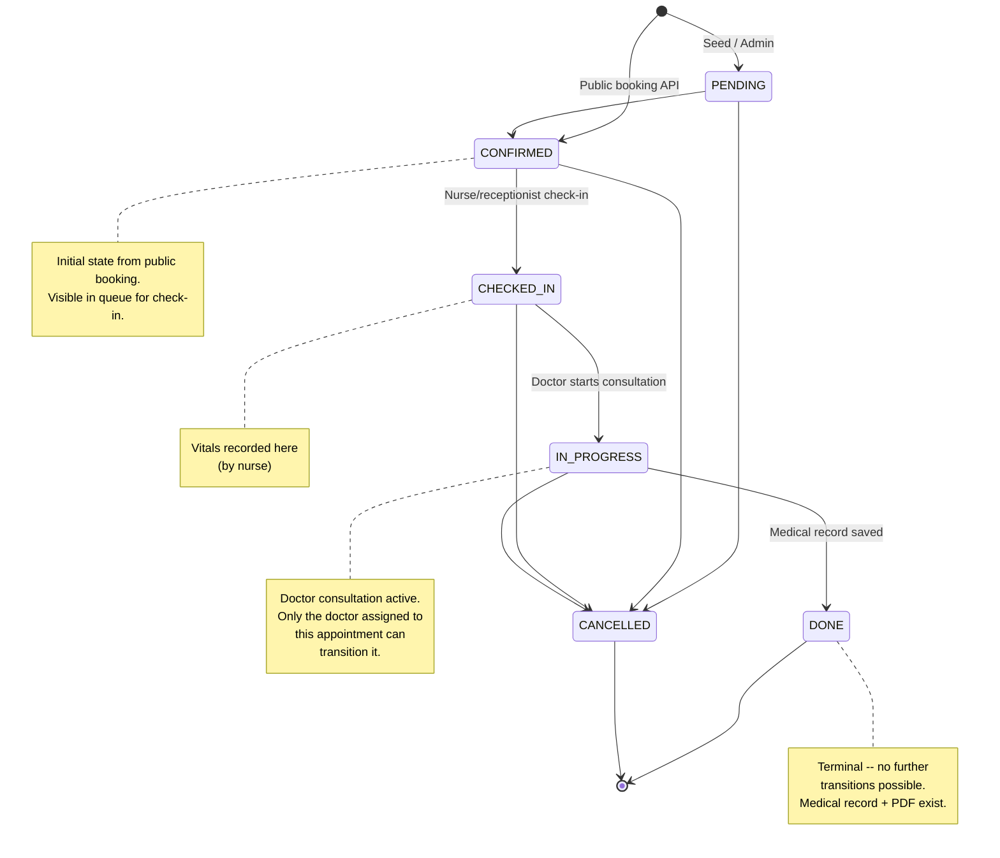
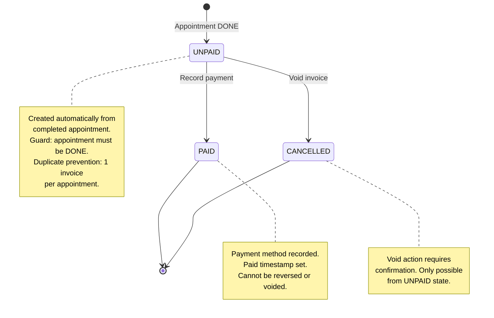
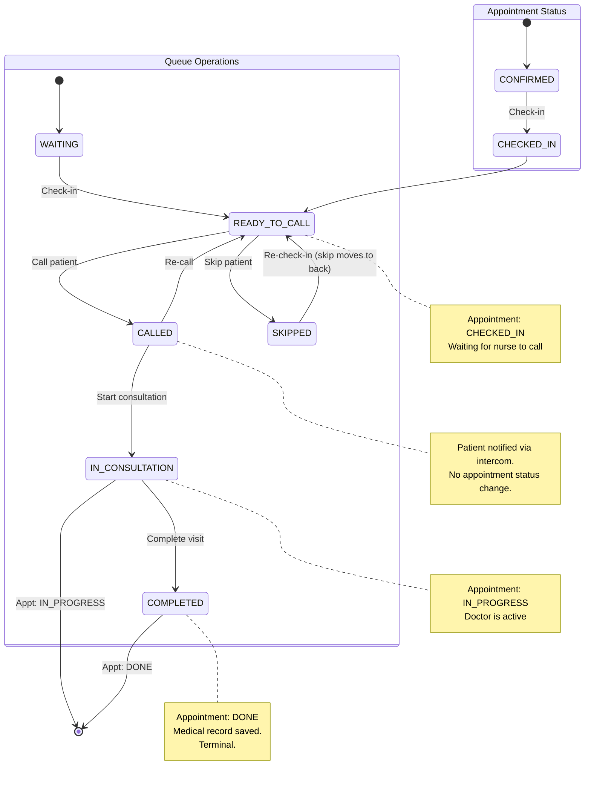
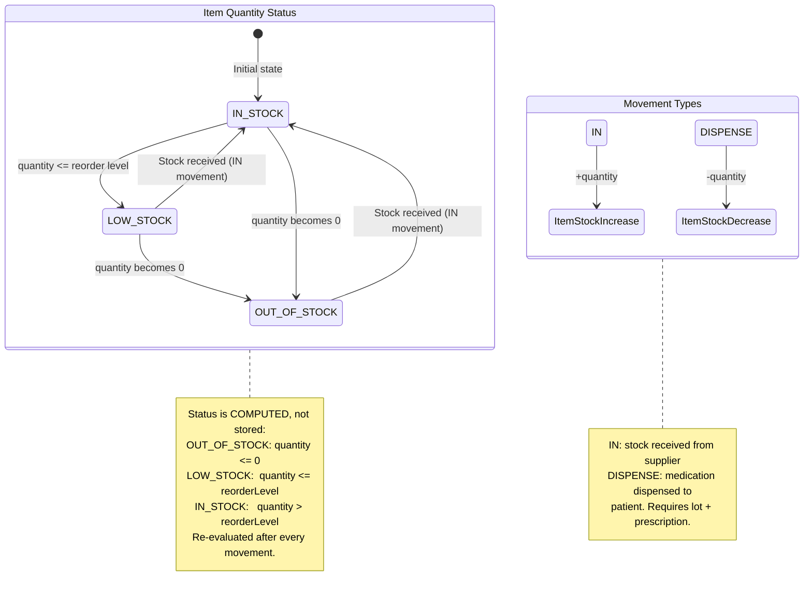
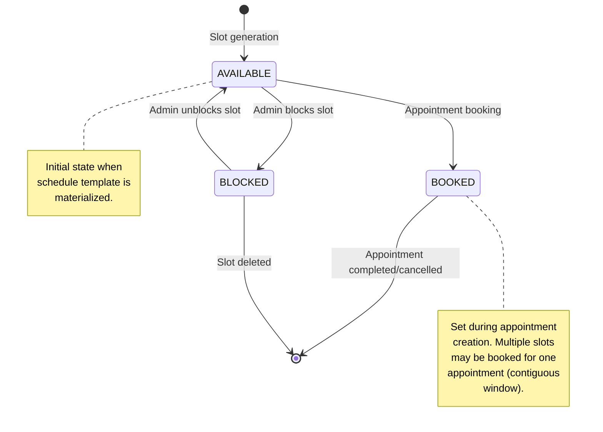
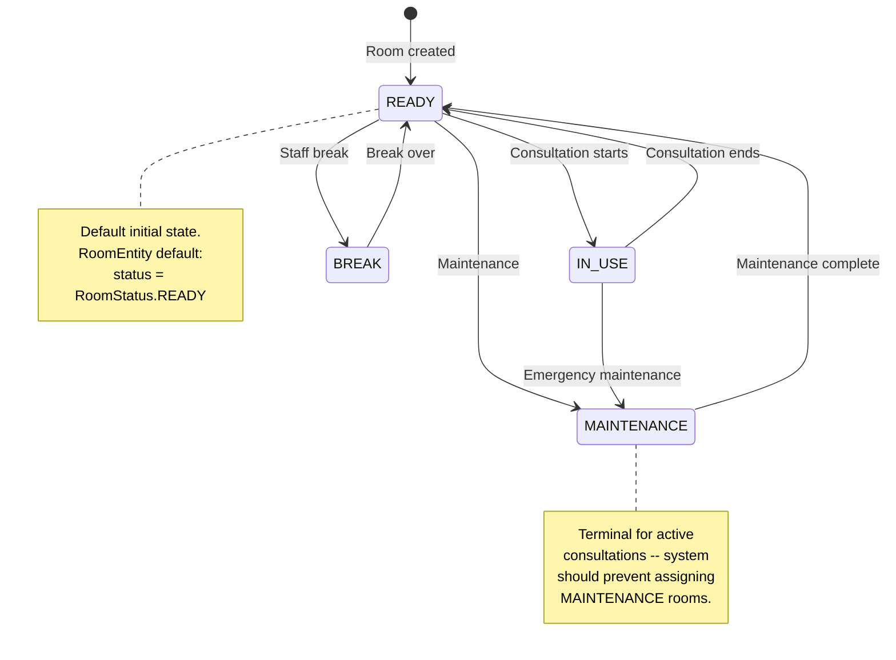

# Entity State Machines

**Version:** 2.0
**Date:** 2026-06-14
**Scope:** All entity state machines in the Hospital Management System

---

## 1. Appointment Lifecycle

**Enum:** `com.hospital.shared.enums.AppointmentStatus`

```java
public enum AppointmentStatus {
  PENDING,
  CONFIRMED,
  CHECKED_IN,
  IN_PROGRESS,
  DONE,
  CANCELLED
}
```

**States:**

| State | Description | Set by |
|-------|-------------|--------|
| `PENDING` | Pre-booking state (used primarily in seed data; not set by the public booking endpoint) | Admin / Seed |
| `CONFIRMED` | Appointment created and confirmed; visible in queue for check-in | `AppointmentWriteService.createAppointment()` |
| `CHECKED_IN` | Patient has arrived and been checked in by receptionist or nurse | `AppointmentWorkflowService.checkInAppointment()` |
| `IN_PROGRESS` | Doctor consultation active | Queue `markInConsultation()` or Doctor status API |
| `DONE` | Clinical visit completed -- medical record saved, prescription PDF available | `MedicalRecordService.createMedicalRecord()` |
| `CANCELLED` | Appointment cancelled at any point before completion | `AppointmentWorkflowService.cancelAppointment()` |



### Transition Details

| From | To | Trigger | Method | Actor (RBAC Permission) | Guard |
|------|----|---------|--------|------------------------|-------|
| `[new]` | `PENDING` | Admin seed / manual creation | SeedService | Admin (`APPOINTMENT_WRITE`) | -- |
| `[new]` | `CONFIRMED` | Public booking | `AppointmentWriteService.createAppointment()` | Guest / Patient / any role | Slot must be `AVAILABLE` and contiguous; valid patient data; slot belongs to doctor |
| `PENDING` | `CONFIRMED` | Booking validation | (future / manual) | Admin (`APPOINTMENT_WRITE`) | -- |
| `PENDING` | `CANCELLED` | Cancel | `cancelAppointment()` | Admin (`APPOINTMENT_CANCEL`) | Status != CANCELLED and != DONE |
| `CONFIRMED` | `CHECKED_IN` | Check-in | `checkInAppointment()` | Nurse, Receptionist (`QUEUE_CHECK_IN`), Admin | Appointment is CONFIRMED; ConflictException otherwise |
| `CONFIRMED` | `CANCELLED` | Cancel | `cancelAppointment()` | Admin (`APPOINTMENT_CANCEL`) | Status != CANCELLED and != DONE |
| `CHECKED_IN` | `IN_PROGRESS` | Start consultation (queue) | `markInConsultation()` | Nurse (`QUEUE_MANAGE`) | Status is CHECKED_IN |
| `CHECKED_IN` | `IN_PROGRESS` | Status update (doctor) | `updateAppointmentStatus()` | Doctor (`APPOINTMENT_STATUS_WRITE`) | Doctor owns this appointment; status is CHECKED_IN |
| `CHECKED_IN` | `CANCELLED` | Cancel | `cancelAppointment()` | Admin (`APPOINTMENT_CANCEL`) | Status != CANCELLED and != DONE |
| `IN_PROGRESS` | `DONE` | Create medical record | `MedicalRecordService.createMedicalRecord()` | Doctor (auth check in service) | Medical record does not already exist for appointment; doctor owns the appointment; appointment status is CHECKED_IN, IN_PROGRESS, or DONE |
| `IN_PROGRESS` | `CANCELLED` | Cancel | `cancelAppointment()` | Admin (`APPOINTMENT_CANCEL`) | Status != CANCELLED and != DONE |

### Invalid Transitions (Blocked)

| From | To | Attempted via | Error |
|------|----|---------------|-------|
| `DONE` | any | `cancelAppointment()` | `409 ConflictException` -- "Cannot cancel a done appointment" |
| `CANCELLED` | any | `cancelAppointment()` | `409 ConflictException` -- "Cannot cancel a cancelled appointment" |
| `CONFIRMED` | `IN_PROGRESS` | Doctor status API | `409 ConflictException` -- "Invalid appointment status transition" |
| `CHECKED_IN` | `DONE` | Doctor status API | `409 ConflictException` -- "Invalid appointment status transition" |
| `IN_PROGRESS` | `DONE` | Doctor status API | `409 ConflictException` -- "Invalid appointment status transition" (DONE only via medical record) |
| `PENDING` | `CHECKED_IN` | `checkInAppointment()` | `409 ConflictException` -- "Only confirmed appointments can be checked in" |
| `IN_PROGRESS` (other doctor's) | `IN_PROGRESS` | Doctor status API | `403 AccessDeniedException` |

### Permission Matrix for Status Changes

| Action | Guest | Patient | Receptionist | Nurse | Doctor | Pharmacist | Accountant | Admin |
|--------|-------|---------|--------------|-------|--------|------------|------------|-------|
| Create booking (-> CONFIRMED) | Yes | Yes | Yes | Yes | Yes | Yes | Yes | Yes |
| Check-in (-> CHECKED_IN) | -- | -- | Yes | Yes | -- | -- | -- | Yes |
| Start consultation (-> IN_PROGRESS) | -- | -- | (Queue) | (Queue) | Yes | -- | -- | Yes |
| Complete (-> DONE) | -- | -- | (Queue) | (Queue) | Yes* | -- | -- | Yes |
| Cancel (-> CANCELLED) | -- | -- | -- | -- | -- | -- | -- | Yes |

*Doctor can only complete their own appointments and only through medical record creation, not via the status API.

### Guard Conditions Detail

**Doctor Ownership:** A doctor can only view and transition their own appointments. This is enforced at the service layer:
```java
if (!appointment.getDoctor().getId().equals(doctorId)) {
  throw new AccessDeniedException("Doctor cannot manage another doctor's appointment");
}
```

**Cancel Eligibility:** Cancellation is blocked only when status is already `DONE` or `CANCELLED`. All other states (PENDING, CONFIRMED, CHECKED_IN, IN_PROGRESS) can be cancelled.

**DONE Gate:** The `IN_PROGRESS -> DONE` transition is exclusive to the medical record creation flow (`MedicalRecordService.createMedicalRecord()`). The doctor status API (`PUT /appointments/{id}/status`) only allows `CHECKED_IN -> IN_PROGRESS`. Calling it with `DONE` raises a `409 ConflictException`.

**Medical Record Precondition:** Creating a medical record additionally requires that no medical record already exists for the appointment (prevents duplicates, 409 Conflict), and the appointment status must be CHECKED_IN, IN_PROGRESS, or DONE. If the status is CHECKED_IN or IN_PROGRESS, it is automatically advanced to DONE.

---

## 2. Invoice Lifecycle

**Enum:** `com.hospital.shared.enums.InvoiceStatus`

```java
public enum InvoiceStatus {
  UNPAID,
  PAID,
  CANCELLED
}
```

**States:**

| State | Description |
|-------|-------------|
| `UNPAID` | Invoice created, payment not yet received |
| `PAID` | Payment recorded against invoice; appears in revenue reports |
| `CANCELLED` | Invoice voided from UNPAID state |



### Transition Details

| From | To | Trigger | Method | Actor (RBAC Permission) | Guard |
|------|----|---------|--------|------------------------|-------|
| `[new]` | `UNPAID` | Create invoice | `InvoiceService.createInvoice(appointmentId)` | Accountant, Admin (`INVOICE_WRITE`) | Appointment status is DONE; no invoice exists for this appointment |
| `UNPAID` | `PAID` | Record payment | `InvoiceService.recordPayment(invoiceId, paymentMethod)` | Accountant, Admin (`INVOICE_WRITE`) | Status is UNPAID; payment method required |
| `UNPAID` | `CANCELLED` | Void invoice | `InvoiceService.voidInvoice(invoiceId)` | Accountant, Admin (`INVOICE_WRITE`) | Status is UNPAID (not PAID) |

### Invalid Transitions (Blocked)

| From | To | Error |
|------|----|-------|
| `PAID` | `CANCELLED` | `409 ConflictException` -- "Paid invoices cannot be voided" |
| `CANCELLED` | `PAID` | `409 ConflictException` -- "Only pending invoices can be paid" |
| `PAID` | `UNPAID` | `409 ConflictException` -- "Only pending invoices can be paid" |
| Duplicate invoice | `UNPAID` | `409 ConflictException` -- "Invoice already exists for this appointment" |

### Creation Guard Detail

Invoices can only be created for appointments in `DONE` status. This ensures that billing happens after the consultation is complete:

```java
if (appointment.getStatus() != AppointmentStatus.DONE) {
  throw new ConflictException("Only completed appointments can be invoiced");
}
```

The base fee is determined by department pricing rules. If no pricing rule exists for the department, a default consultation fee of 250,000 VND is used.

---

## 3. Queue States (Operational)

The queue is an operational layer on top of the appointment state machine. Queue actions do not always change the appointment status -- some are non-state-mutating operations (call, skip, assign room) that only record audit events.

**Runtime Mapping (from `staff-queue.ts`):**

| Queue Filter | Appointment Status |
|-------------|-------------------|
| `waiting` | `CONFIRMED` or `PENDING` |
| `ready` | `CHECKED_IN` |
| `in_progress` | `IN_PROGRESS` |



### Queue Action to Appointment Mapping

| Queue Action | Method | Queue State Change | Appointment Status Change | API Endpoint |
|-------------|--------|-------------------|--------------------------|--------------|
| Check-in | `checkInAppointment()` | → WAITING | CONFIRMED → CHECKED_IN | `POST /appointments/{id}/checkin` |
| Call | `callQueuePatient()` | → CALLED | (no change) | `POST /queue/{id}/call` |
| Assign Room | `assignQueueRoom()` | (room noted) | (no change) | `POST /queue/{id}/assign-room` |
| Start Consultation | `markInConsultation()` | → IN_CONSULTATION | CHECKED_IN → IN_PROGRESS | `POST /queue/{id}/start-consultation` |
| Complete | `completeQueueVisit()` | → COMPLETED | IN_PROGRESS → DONE | `POST /queue/{id}/complete` |
| Skip | `skipQueuePatient()` | → SKIPPED | (no change; checkedInAt updated) | `POST /queue/{id}/skip` |

### Queue Action Guards

| Action | Precondition (Appointment Status) | Roles (RBAC) | Effect on Non-conforming |
|--------|----------------------------------|--------------|--------------------------|
| Check-in | `CONFIRMED` | `QUEUE_CHECK_IN` | `409 ConflictException` -- "Only confirmed appointments can be checked in" |
| Call | `CHECKED_IN` or `IN_PROGRESS` | `QUEUE_MANAGE` | `409 ConflictException` -- "Only active queue appointments can be called" |
| Assign Room | `CHECKED_IN` or `IN_PROGRESS` | `QUEUE_MANAGE` | `409 ConflictException` -- Room name must be non-blank |
| Start Consultation | `CHECKED_IN` | `QUEUE_MANAGE` | `409 ConflictException` -- "Only ready queue appointments can move into consultation" |
| Complete | `IN_PROGRESS` | `QUEUE_MANAGE` | `409 ConflictException` -- "Appointment must be in consultation before it can be completed" |
| Skip | `CHECKED_IN` | `QUEUE_MANAGE` | `409 ConflictException` -- "Only ready queue appointments can be skipped" |

### Non-State-Mutating Operations

**Call** and **Skip** do not change the appointment's persistent status; they only update timestamps and write audit logs:

- `callQueuePatient()` -- records a `QUEUE_CALL_PATIENT` audit entry. The patient's position in the queue is determined by `checkedInAt` and `startTime` ordering.
- `skipQueuePatient()` -- updates `checkedInAt` to the current time, effectively moving the patient to the back of the ready queue. Records a `QUEUE_SKIP_PATIENT` audit entry.
- `assignQueueRoom()` -- appends a room assignment note to the appointment's `notes` field. Records a `QUEUE_ASSIGN_ROOM` audit entry.

### Queue Ordering

The queue sorts patients by:
1. `checkedInAt` (ascending, nulls last)
2. `appointmentDate`
3. `startTime`

This means patients who checked in earlier appear first, regardless of their original appointment time.

---

## 4. Inventory Movement

**Entity:** `InventoryMovementEntity` with `movementType` (free-text String, not an enum)

Movement types are stored as free-form strings. The system recognizes the following conventional types:

| Movement Type | Description | Quantity Delta | Effect |
|---------------|-------------|----------------|--------|
| `IN` | Stock received from supplier | Positive (increase) | `quantityOnHand` increases; `lastRestockedAt` updated |
| `DISPENSE` | Medication dispensed to patient | Negative (decrease) | Both item stock and lot remaining decrease |
| (any custom type) | Arbitrary stock adjustment via `recordMovement()` | Any signed integer | `quantityOnHand` adjusted; no lot tracking |

**Note:** The `movementType` field accepts any string value. The two supported workflow-specific types are `IN` (stock receipt) and `DISPENSE` (pharmacy dispensation). The generic `recordMovement()` endpoint accepts any type for flexible stock adjustments.



### Movement Rules

| Movement Type | Precondition | Effect | Audit Log |
|---------------|-------------|--------|-----------|
| `IN` | Item exists; quantityDelta > 0 (increase). No lot required. | Item `quantityOnHand` increases; `lastRestockedAt` updated. | `INVENTORY_MOVEMENT_RECORDED` |
| `DISPENSE` | Prescription item exists on medical record. Lot matches item. Sufficient quantity in lot and on hand. | Item stock and lot remaining both decrease. DispenseNote records lot + medical record trace. | `PHARMACY_MEDICATION_DISPENSED` |
| (custom) | Item exists; resulting `quantityOnHand` >= 0 | Item `quantityOnHand` adjusted. | `INVENTORY_MOVEMENT_RECORDED` |

### Dispense Validation Rules (from `InventoryWriteService.dispenseMedication()`)

1. **Quantity:** Must be greater than zero.
2. **Lot Belongs to Item:** `lot.getItem().getId()` must equal `item.getId()`.
3. **Prescription Match:** The dispensed medicine name must match a prescription item on the medical record (case-insensitive, trimmed comparison).
4. **Sufficient Lot Quantity:** `lot.getQuantityRemaining() >= request.quantity()`.
5. **Sufficient Item Stock:** `item.getQuantityOnHand() >= request.quantity()`.
6. **No Negative Stock:** All paths check `nextQuantityOnHand >= 0` before committing.

### Error Behavior

| Condition | Error |
|-----------|-------|
| Item not found | `404 NotFoundException` |
| Lot not found | `404 NotFoundException` |
| Lot does not belong to item | `409 ConflictException` -- "Inventory lot does not belong to the selected item" |
| Prescription item not found on record | `409 ConflictException` -- "Prescription item is not present on the selected medical record" |
| Insufficient lot quantity | `409 ConflictException` -- "Inventory lot does not have enough quantity remaining" |
| Insufficient item stock | `409 ConflictException` -- "Inventory item does not have enough quantity on hand" |
| Resulting quantity negative | `409 ConflictException` -- "Inventory movement cannot make quantity on hand negative" |

### Stock Status Computation

Stock status is **not** a persistent field; it is recomputed on every movement:

```java
private String toStockStatus(int quantityOnHand, int reorderLevel) {
  if (quantityOnHand <= 0)           return "OUT_OF_STOCK";
  if (quantityOnHand <= reorderLevel) return "LOW_STOCK";
  return "IN_STOCK";
}
```

Alerts (via `InventoryService.listAlerts()`):
- **`LOW_STOCK`** (severity `WARNING`): quantity on hand <= reorder level
- **`OUT_OF_STOCK`** (severity `CRITICAL`): quantity on hand <= 0
- **`EXPIRING_SOON`** (severity `WARNING`): lot expires within 30 days
- **`EXPIRED`** (severity `CRITICAL`): lot already expired

---

## 5. Slot States

**Enum:** `com.hospital.shared.enums.SlotStatus`

```java
public enum SlotStatus {
  AVAILABLE,
  BOOKED,
  BLOCKED
}
```

**States:**

| State | Description |
|-------|-------------|
| `AVAILABLE` | Slot is open for booking |
| `BOOKED` | Slot reserved by an appointment |
| `BLOCKED` | Slot manually blocked by admin (not bookable) |



### Transition Guards

| From | To | Trigger | Actor | Guard |
|------|----|---------|-------|-------|
| `[new]` | `AVAILABLE` | Schedule materialization | System | Template exists, no slot for this time yet |
| `AVAILABLE` | `BOOKED` | Appointment booking | System (in `AppointmentWriteService`) | Slots are contiguous; all are AVAILABLE; slot belongs to doctor |
| `AVAILABLE` | `BLOCKED` | Admin blocks slot | Admin (`TimeSlotAdminService`) | Slot is AVAILABLE |
| `BLOCKED` | `AVAILABLE` | Admin unblocks slot | Admin (`TimeSlotAdminService`) | Slot is BLOCKED |

**Contiguous Booking Guard:** When an appointment spans multiple slots (determined by `aiDurationMinutes`), all required slots are locked atomically with `SELECT ... FOR UPDATE` and validated for contiguity:

```java
// All slots must be AVAILABLE
// Each slot's endTime must equal the next slot's startTime
```

---

## 6. Room States

**Enum:** `com.hospital.shared.enums.RoomStatus`

```java
public enum RoomStatus {
  READY,
  IN_USE,
  BREAK,
  MAINTENANCE
}
```

**States:**

| State | Description |
|-------|-------------|
| `READY` | Room is clean and available for use |
| `IN_USE` | Room occupied by a consultation |
| `BREAK` | Staff break in progress |
| `MAINTENANCE` | Room under maintenance |



### Actual Code Behavior

The room state machine has **no enforced guards** in the current implementation. `OperationsAdminService.updateRoomStatus()` accepts any `RoomStatus` value unconditionally:

```java
public AdminRoomResponse updateRoomStatus(UUID roomId, RoomStatus status) {
  var room = roomRepository.findById(roomId).orElseThrow(() -> new NotFoundException("Room not found"));
  room.setStatus(status);
  return toRoomResponse(room);
}
```

Room deletion is a **soft delete** -- the `active` flag is set to `false`, preserving historical references.

---

## 7. Lab Result Status

Lab result status is stored as a free-text string in `lab_results.status`. It has **no enum** and **no enforced state machine**.

Common values observed in tests and data:

| Status | Description |
|--------|-------------|
| `PENDING` | Result requested, not yet available |
| `COMPLETED` | Result finalized |
| `CRITICAL` | Result value is critically abnormal |

**Guard:** Only Doctor and Admin roles can delete lab results. Patient portal access is read-only.

---

## Summary of All State Machines

| Entity | Enum / Field | States | Transitions |
|--------|-------------|--------|-------------|
| Appointment | `AppointmentStatus` (enum) | 6 | CONFIRMED -> CHECKED_IN -> IN_PROGRESS -> DONE (happy path); CANCELLED from PENDING, CONFIRMED, CHECKED_IN, IN_PROGRESS |
| Invoice | `InvoiceStatus` (enum) | 3 | UNPAID -> PAID; UNPAID -> CANCELLED |
| Queue | Operational state (derived) | 5 | WAITING -> CALLED -> IN_CONSULTATION -> COMPLETED; SKIPPED from CALLED or CHECKED_IN |
| Slot | `SlotStatus` (enum) | 3 | AVAILABLE -> BOOKED/BLOCKED; BLOCKED -> AVAILABLE |
| Room | `RoomStatus` (enum) | 4 | READY -> IN_USE/BREAK/MAINTENANCE; IN_USE -> READY/MAINTENANCE; BREAK/MAINTENANCE -> READY (unguarded transitions) |
| Item Stock | Computed String | 3 | IN_STOCK -> LOW_STOCK -> OUT_OF_STOCK (computed on every movement) |
| Inventory Movement | `movementType` (free text) | 2 conventional types | IN (+stock), DISPENSE (-stock with lot + prescription tracking) |
| Lab Result | `status` (free text) | Common: PENDING, COMPLETED, CRITICAL | No enforced state machine |

### Enforcement Summary

| State Machine | Enforcement | Error Type |
|---------------|-------------|------------|
| Appointment | Fully enforced in service layer | `ConflictException` (409) |
| Invoice | Fully enforced in service layer | `ConflictException` (409) |
| Queue | Enforced through appointment state | `ConflictException` (409) |
| Slot | Enforced in booking flow | `ConflictException` (409) |
| Room | No guard enforcement -- direct set | (any value accepted) |
| Inventory | Quantity invariants enforced | `ConflictException` (409) |
| Lab Result | No state machine enforced | (free text) |
