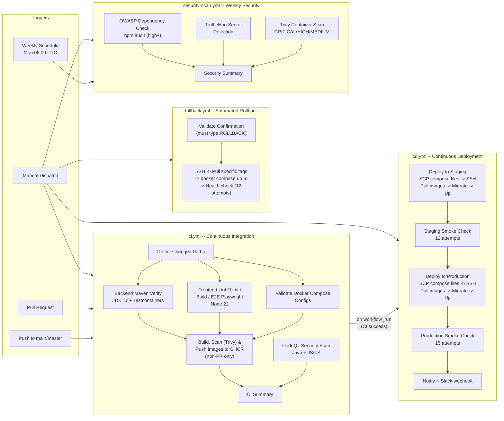

# CI/CD Pipeline

## Overview

The Hospital Management System uses **GitHub Actions** for continuous integration and continuous deployment. Four workflows automate the full lifecycle: build and test (CI), deploy (CD), automated rollback, and scheduled security scanning.

All container images are published to **GitHub Container Registry (GHCR)** under the `ghcr.io/tranhquan099-commits/hospital-management-system` namespace.

**Related documentation:**
- [Deployment Guide](./deployment-guide.md) -- manual deployment and local setup
- [Docker](./docker.md) -- Docker Compose service definitions
- [Environment Variables](./env-variables.md) -- full .env reference

---

## Pipeline Diagram



---

## Workflow: CI (`ci.yml`)

**File:** `.github/workflows/ci.yml`

**Purpose:** Build, test, and package the application on every push or pull request.

### Triggers

| Event | Condition |
|-------|-----------|
| `push` | `main` or `master` branch (skips markdown-only, docs-only, .gitignore, LICENSE changes) |
| `pull_request` | Any PR targeting `main` or `master` (same path filters) |
| `workflow_dispatch` | Manual trigger via GitHub UI or CLI |

**Concurrency:** Jobs on the same PR/branch are cancelled in favour of the latest run. This avoids wasting CI minutes on stale commits.

### Permissions

- `contents: read` -- checkout and artifact operations
- `packages: write` -- push container images to GHCR
- `security-events: write` -- upload CodeQL and Trivy SARIF results
- `actions: read` -- workflow status inspection

### Path Detection (`changes`)

Before any test job runs, the `changes` job evaluates a **path filter** to determine which parts of the codebase were modified. This allows skipping irrelevant jobs on partial changes.

| Output | Paths |
|--------|-------|
| `backend` | `backend/**`, `.github/workflows/ci.yml`, `.github/workflows/cd.yml` |
| `frontend` | `frontend/src/**`, `frontend/public/**`, `frontend/e2e/**`, `frontend/*.{ts,js,json,css}`, CI/CD workflow files |
| `infra` | `docker-compose.yml`, `docker-compose.observability.yml`, `infra/observability/**`, `backend/Dockerfile`, `frontend/Dockerfile` |

Each test job (`backend-test`, `frontend-test`, `validate-observability`) checks its path output before running. On non-PR events (push to main/master), all jobs run unconditionally.

### Jobs Overview

| Job | Runner | Timeout | Depends On | Runs When |
|-----|--------|---------|------------|-----------|
| `changes` | ubuntu-latest | 2 min | -- | Always |
| `codeql` | ubuntu-latest | 20 min | -- | Always |
| `backend-test` | ubuntu-latest | 25 min | `changes` | Backend changed or non-PR |
| `frontend-test` | ubuntu-latest | 20 min | `changes` | Frontend changed or non-PR |
| `validate-observability` | ubuntu-latest | 5 min | `changes` | Infra changed or non-PR |
| `docker-push` | ubuntu-latest | 20 min | backend-test, frontend-test, validate-observability | Non-PR only (push/main) |
| `ci-summary` | ubuntu-latest | 2 min | backend-test, frontend-test, validate-observability, codeql | Always (even on failure) |

### Job Details

#### CodeQL Security Scan (`codeql`)

Runs GitHub's CodeQL analysis on both Java/Kotlin and JavaScript/TypeScript codebases in parallel (matrix strategy, `fail-fast: false` -- a failure in one language does not cancel the other).

- Queries: `security-extended` and `security-and-quality`
- Auto-build enabled for both languages
- Results uploaded as SARIF to GitHub code scanning alerts

#### Backend Test (`backend-test`)

Validates the Spring Boot backend with unit and integration tests.

**Service container:** PostgreSQL 15 with pgvector extension (`pgvector/pgvector:pg15`)

| Service Config | Value |
|----------------|-------|
| Database | `hospital_db` |
| User | `hospital_user` |
| Password | `testpass` |
| Health check | `pg_isready -U hospital_user -d hospital_db` (10s interval, 5 retries) |

**Steps:**

1. **Checkout** repository
2. **Set up JDK 17** (Temurin) with Maven cache (`actions/setup-java@v4`)
3. **Run `mvn -B verify`** with the following system properties:
   - `spring.datasource.url=jdbc:postgresql://localhost:5432/hospital_db`
   - `spring.datasource.username=hospital_user`
   - `spring.datasource.password=testpass`
   - `spring.jpa.hibernate.ddl-auto=create-drop`
   - Environment: `JWT_SECRET`, `PATIENT_IDENTIFIER_SECRET` (CI test values)
4. **Upload JaCoCo coverage report** -- `target/site/jacoco/jacoco.xml` and `index.html` (14-day retention)
5. **Upload test reports** -- `target/surefire-reports/` (7-day retention)

#### Frontend Test (`frontend-test`)

Validates the Next.js frontend with lint, unit tests, production build, and E2E tests.

**Software:** Node.js 22 with npm dependency caching

**Caching strategy:**

| Cache | Key | Scope |
|-------|-----|-------|
| npm dependencies | Based on `package-lock.json` hash | Dependency install |
| Playwright browsers | Playwright version from `package.json` | Browser binary (~350 MB) |
| Next.js build | Hash of source files + config | Production build |

**Steps:**

1. **Checkout** repository
2. **Set up Node.js 22** with npm cache
3. **`npm ci`** -- clean install (respects lockfile)
4. **Install Playwright Chromium** (only on cache miss)
5. **`npm run lint`** -- ESLint with Next.js config
6. **`npm run test:unit:coverage`** -- Vitest unit tests with coverage
7. **`npm run build`** -- production Next.js build (with `NEXT_PUBLIC_API_BASE_URL` set)
8. **`npm run test:e2e:ci`** -- Playwright E2E tests against production build (Chromium only)
9. **Upload artifacts** -- coverage report (14 days), Playwright report + test-results (7 days)

#### Validate Observability Config (`validate-observability`)

Ensures the Docker Compose configurations are syntactically valid.

- Validates `docker-compose.yml` standalone
- Validates combined `docker-compose.yml` + `docker-compose.observability.yml`
- Uses `docker compose config --quiet` (exit code 0 = valid)

#### Docker Build and Push (`docker-push`)

Builds container images, scans them for vulnerabilities, and pushes to GHCR. Only runs on non-PR events (push to main/master).

**Image tags:**

| Image | Tags |
|-------|------|
| Backend | `ghcr.io/.../backend:latest`, `ghcr.io/.../backend:{sha}` |
| Frontend | `ghcr.io/.../frontend:latest`, `ghcr.io/.../frontend:{sha}` |

**Build cache:** Uses GitHub Actions cache (`type=gha`, `mode=max`) for layer caching across runs.

**Vulnerability scanning (Trivy):**

- Severity: `CRITICAL, HIGH` only
- Format: SARIF (GitHub code scanning integration)
- `exit-code: 0` -- scanning results do not fail the build (advisory only)
- Separate scan for backend and frontend images

**Backend build args:** `NEXT_PUBLIC_API_BASE_URL=http://localhost:8081/api/v1`

#### CI Summary (`ci-summary`)

Generates a markdown summary of all CI job results in `GITHUB_STEP_SUMMARY`. Displays a table with job name, result, and icons. Flags overall failure if any job failed.

---

## Workflow: CD (`cd.yml`)

**File:** `.github/workflows/cd.yml`

**Purpose:** Deploy the application to staging and production environments on VPS instances.

### Triggers

| Event | Condition |
|-------|-----------|
| `workflow_run` | The `HMS CI` workflow completes successfully on `main`/`master` |
| `workflow_dispatch` | Manual trigger with environment selection and optional image tag |

**Manual dispatch parameters:**

| Parameter | Type | Default | Description |
|-----------|------|---------|-------------|
| `environment` | choice | -- | `staging` or `production` |
| `image-tag` | string | `latest` | Specific image tag to deploy (e.g., a commit SHA) |

### Pipeline Stages

#### 1. Deploy to Staging (`deploy-staging`)

**Environment:** `staging` (URL from `vars.STAGING_URL` or fallback `https://staging.hms.local`)

**Steps:**

1. **Checkout** repository
2. **Resolve GHCR token** -- uses `secrets.GHCR_PAT` if available, otherwise falls back to `secrets.GITHUB_TOKEN`
3. **Set image tag** -- uses manual input or defaults to `latest`
4. **Copy compose files to VPS** (`appleboy/scp-action@v0.1.7`):
   - `docker-compose.yml`
   - `docker-compose.observability.yml`
   - `infra/observability` directory
   - Target: `~/apps/hospital-management` on the VPS
5. **SSH deploy script** (`appleboy/ssh-action@v1.2.0`):
   ```bash
   # Login to GHCR
   echo $TOKEN | docker login ghcr.io -u $ACTOR --password-stdin

   # Export image tags as environment variables for docker compose
   export BACKEND_IMAGE="ghcr.io/$REPO/backend:$TAG"
   export FRONTEND_IMAGE="ghcr.io/$REPO/frontend:$TAG"

   # Pull latest images
   docker compose pull

   # Run database migrations (Spring Boot migrate profile)
   docker compose run --rm backend java -jar /app/app.jar \
     --spring.profiles.active=migrate

   # Recreate containers (include observability stack if config exists)
   if [ -f docker-compose.observability.yml ]; then
     docker compose -f docker-compose.yml -f docker-compose.observability.yml \
       up -d --remove-orphans
   else
     docker compose up -d --remove-orphans
   fi

   # Prune old images
   docker image prune -f
   ```
6. **Smoke check** -- 12 attempts, 10-second interval:
   ```bash
   curl -sSf http://localhost:8081/api/v1/public/health
   ```

#### 2. Deploy to Production (`deploy-production`)

**Depends on:** `deploy-staging` (staging must succeed first)

**Environment:** `production` (URL from `vars.PROD_URL` or fallback `https://hms.local`)

Same process as staging, with two differences:

| Aspect | Staging | Production |
|--------|---------|------------|
| Host secret | `DEPLOY_HOST_STAGING` | `DEPLOY_HOST` |
| User secret | `DEPLOY_USER_STAGING` | `DEPLOY_USER` |
| SSH key secret | `DEPLOY_SSH_KEY_STAGING` | `DEPLOY_SSH_KEY` |
| Smoke check attempts | 12 | 15 |

#### 3. Notify (`notify`)

Sends a Slack notification with deployment status.

**Status determination:**

| Condition | Emoji | Colour |
|-----------|-------|--------|
| Production succeeded | :rocket: | `good` (green) |
| Only staging succeeded | :microscope: | `warning` (yellow) |
| Any deployment failed | :x: | `danger` (red) |

**Slack configuration:** Uses `slackapi/slack-github-action@v2` with an incoming webhook URL stored in `vars.SLACK_WEBHOOK_URL`. If the variable is empty, the step logs the status to the workflow console and skips the webhook call.

### Required Secrets

| Secret | Staging | Production | Purpose |
|--------|---------|------------|---------|
| `DEPLOY_HOST` / `DEPLOY_HOST_STAGING` | Yes | Yes | VPS IP or hostname |
| `DEPLOY_USER` / `DEPLOY_USER_STAGING` | Yes | Yes | SSH username |
| `DEPLOY_SSH_KEY` / `DEPLOY_SSH_KEY_STAGING` | Yes | Yes | SSH private key |
| `GHCR_PAT` | Optional | Optional | GHCR personal access token (falls back to `GITHUB_TOKEN`) |

### Environment Variables (GitHub Variables)

| Variable | Purpose |
|----------|---------|
| `vars.STAGING_URL` | Staging environment URL (displayed in GitHub UI) |
| `vars.PROD_URL` | Production environment URL (displayed in GitHub UI) |
| `vars.SLACK_WEBHOOK_URL` | Slack incoming webhook for deployment notifications |

---

## Workflow: Rollback (`rollback.yml`)

**File:** `.github/workflows/rollback.yml`

**Purpose:** Revert a deployment to a known-good image tag on demand.

### Trigger

Manual dispatch (`workflow_dispatch`) only -- never automated.

### Parameters

| Parameter | Type | Required | Default | Description |
|-----------|------|----------|---------|-------------|
| `environment` | choice | Yes | -- | `staging` or `production` |
| `backend-tag` | string | Yes | -- | Image tag to roll back to (e.g., a commit SHA) |
| `frontend-tag` | string | No | backend-tag | Frontend image tag (defaults to same as backend) |
| `confirm` | string | Yes | -- | Must type `ROLLBACK` exactly |

### Safety Gate: Confirmation

The first job (`validate`) checks that the `confirm` input equals `ROLLBACK`. If not, the workflow fails immediately with an error. This prevents accidental rollbacks from muscle memory.

### Process

1. **Resolve parameters** (`params` job):
   - Defaults `frontend-tag` to `backend-tag` if not provided
   - Selects host/user/key based on target environment
2. **SSH rollback** (`appleboy/ssh-action@v1.2.0`):
   ```bash
   cd ~/apps/hospital-management

   # Pull the specific image versions
   docker pull ghcr.io/$REPO/backend:$BTAG
   docker pull ghcr.io/$REPO/frontend:$FTAG

   # Override image tags via environment variables and redeploy
   BACKEND_IMAGE="ghcr.io/$REPO/backend:$BTAG" \
   FRONTEND_IMAGE="ghcr.io/$REPO/frontend:$FTAG" \
   docker compose up -d --remove-orphans
   ```
3. **Health check** -- 12 attempts, 10-second interval on the health endpoint

### Rollback Strategy

- **Image-based rollback:** Because every CI run publishes immutable SHA-tagged images, any previous version can be redeployed instantly without rebuilding.
- **No DB rollback:** Database migrations are not automatically reversed. If the rollback involves a schema change, a manual database restore or forward migration is required before rolling back the application code.
- **Latest tag caveat:** The `:latest` tag is overwritten on every CI push. To roll back to a previous state, always use a specific commit SHA tag (visible in the GHCR package page or the workflow run log).

---

## Workflow: Security Scan (`security-scan.yml`)

**File:** `.github/workflows/security-scan.yml`

**Purpose:** Scheduled comprehensive security scanning to catch vulnerabilities that may have been introduced since the last CI run.

### Triggers

| Event | Schedule/Details |
|-------|------------------|
| `schedule` | Every Monday at 06:00 UTC (`0 6 * * 1`) |
| `workflow_dispatch` | On-demand manual run |

### Jobs

#### Dependency Review (`dependency-review`)

Scans both frontend and backend dependencies for known vulnerabilities.

| Tool | Scope | Configuration |
|------|-------|---------------|
| `npm audit` | Frontend (`frontend/package-lock.json`) | `--audit-level=high` (only reports high/critical) |
| OWASP Dependency Check | Backend (Maven) | `-DfailBuildOnCVSS=7` (fails on CVSS >= 7), HTML report |

Both steps use `continue-on-error: true` -- scanning results do not fail the workflow. Reports are uploaded as artifacts (14-day retention).

#### Secret Detection (`secret-scan`)

Uses **TruffleHog** to scan the entire repository for exposed secrets.

- `fetch-depth: 0` -- full history for thorough scanning
- `--only-verified` -- only reports secrets that are confirmed valid (reduces false positives)
- Scans against `default_branch` as base, `HEAD` as tip

#### Container Image Scan (`container-scan`)

Scans the published container images in GHCR for OS-level and library vulnerabilities.

**Matrix strategy** (`fail-fast: false`):
- `ghcr.io/${{ github.repository }}/backend:latest`
- `ghcr.io/${{ github.repository }}/frontend:latest`

Uses Trivy with:
- Severity: `CRITICAL, HIGH, MEDIUM` (broader than CI scans which only check CRITICAL/HIGH)
- Format: SARIF, uploaded to GitHub code scanning
- `exit-code: 0` -- advisory only

#### Scan Summary (`scan-summary`)

Generates a markdown summary table in `GITHUB_STEP_SUMMARY` with the result of each scan job and a link to the GitHub Security tab.

---

## Security Scanning Matrix

| Scan | When | Tool | Severity | Build Failure | Report |
|------|------|------|----------|---------------|--------|
| CodeQL | Every CI run | GitHub CodeQL | All | No (advisory) | GitHub code scanning alerts |
| Trivy (CI) | Every push (non-PR) | Trivy | CRITICAL, HIGH | No (advisory) | SARIF -> code scanning |
| npm audit | Weekly + manual | npm | high+ | No (`continue-on-error`) | Console + step summary |
| OWASP DC | Weekly + manual | Dependency Check | CVSS >= 7 | No (`continue-on-error`) | HTML artifact |
| TruffleHog | Weekly + manual | TruffleHog | Verified only | Yes (step fails if found) | Console + annotations |
| Trivy (scheduled) | Weekly + manual | Trivy | CRITICAL, HIGH, MEDIUM | No (`continue-on-error`) | SARIF -> code scanning |

---

## Artifact Retention

| Artifact | Workflow | Retention |
|----------|----------|-----------|
| JaCoCo coverage report (XML + HTML) | CI | 14 days |
| Backend Surefire test reports | CI | 7 days |
| Frontend Vitest coverage | CI | 14 days |
| Playwright report + test-results | CI | 7 days |
| OWASP Dependency Check HTML | Security Scan | 14 days |
| Trivy SARIF reports | CI + Security Scan | Inline (GitHub code scanning) |

---

## Infrastructure Architecture

### VPS Layout

```
~/apps/hospital-management/
  docker-compose.yml              # Core services
  docker-compose.observability.yml # Optional observability stack
  infra/observability/             # Config files for observability
    prometheus.yml
    tempo.yml
    loki.yml
    promtail.yml
    otel-collector.yml
    grafana/
      provisioning/
      dashboards/
```

### Core Services

| Service | Image | Internal Port | Purpose |
|---------|-------|---------------|---------|
| `postgres` | pgvector/pgvector:pg15 | 5432 | Database with vector extension |
| `backend` | ghcr.io/.../backend | 8081 | Spring Boot REST API |
| `frontend` | ghcr.io/.../frontend | 3000 | Next.js web application |

### Observability Stack (Optional)

| Service | Image | Default Port | Purpose |
|---------|-------|-------------|---------|
| `otel-collector` | otel/opentelemetry-collector-contrib | 4317 (gRPC), 4318 (HTTP) | OpenTelemetry trace collection |
| `prometheus` | prom/prometheus | 9090 | Metrics storage and alerting |
| `grafana` | grafana/grafana | 3001 | Dashboards and visualization |
| `tempo` | grafana/tempo | 3200 | Distributed tracing backend |
| `loki` | grafana/loki | 3100 | Log aggregation |
| `promtail` | grafana/promtail | -- | Docker log collector |

### Image Tagging Strategy

| Tag | Stability | Overwritten | Use Case |
|-----|-----------|-------------|----------|
| `:latest` | Unstable | Every CI push | Development, staging |
| `:{sha}` | Immutable | Never | Production, rollback targets |

The `BACKEND_IMAGE` and `FRONTEND_IMAGE` environment variables in `docker-compose.yml` control which image tag is used at runtime. The CD workflow exports these before calling `docker compose up`.

---

## Deployment Flow (End to End)

```
Developer pushes to main/master
        |
        v
  CI workflow triggers
        |
        +---> Path detection (changes)
        +---> CodeQL analysis
        +---> Backend: mvn verify (Testcontainers)
        +---> Frontend: lint + unit test + build + Playwright E2E
        +---> Validate Docker Compose configs
        |
        v
  All CI jobs pass
        |
        v
  Docker push: build, scan (Trivy), push to GHCR
        |  Tags: :latest and :{sha}
        v
  CD workflow triggers (workflow_run on CI success)
        |
        +---> Deploy to staging
        |       SCP compose files -> pull images -> migrate DB -> up -> smoke check
        |
        +---> Deploy to production (only if staging succeeded)
        |       Same process, 15-attempt smoke check
        |
        +---> Notify Slack
```

---

## Database Migrations

The CD workflow runs database migrations as part of the deployment:

```bash
docker compose run --rm backend \
  java -jar /app/app.jar --spring.profiles.active=migrate
```

This executes the Spring Boot `migrate` profile, which runs Flyway/Liquibase migrations and exits. The step is **best-effort**: if the migration command fails (e.g., no pending migrations, or the profile is not configured), the workflow prints a warning and continues. Actual migration errors (schema conflicts, broken migrations) will manifest during the smoke check or immediately after container restart.

**Note:** Deployments are not automatically rolled back on migration failure. Monitor the smoke check and deployment logs.

---

## Troubleshooting

### CI Failures

| Symptom | Likely Cause | Check |
|---------|-------------|-------|
| Backend tests fail | PostgreSQL connection | Service container health in CI logs |
| Frontend E2E fails | Playwright browser cache miss | Browser install step; check `npx playwright install` |
| Docker push fails | GHCR authentication | `packages: write` permission; GHCR PAT validity |
| Path detection skips a job | Path filter not matching | Compare changed files against `dorny/paths-filter` patterns |

### CD Failures

| Symptom | Likely Cause | Check |
|---------|-------------|-------|
| SCP fails | SSH key or hostname | `DEPLOY_SSH_KEY`, `DEPLOY_HOST` secrets |
| Migration step fails | Spring migrate profile | Backend Dockerfile ENTRYPOINT; Flyway config |
| Smoke check fails | Application not ready | VPS logs (`docker compose logs backend`); DB connectivity |
| Image pull fails | GHCR authentication on VPS | `GHCR_PAT` or `GITHUB_TOKEN` validity; `docker login` |

### Rollback

If a deployment is broken:

1. Go to **Actions > Rollback** in the GitHub UI
2. Click **Run workflow**
3. Select the target environment
4. Enter the commit SHA of the last known-good build as `backend-tag`
5. Type `ROLLBACK` in the confirm field
6. Run the workflow

The rollback will pull the specified image tags and redeploy. Monitor the health check at the end.

---

## Security Notes

- **Secrets are never logged.** The CD and rollback workflows pass tokens via GitHub Secrets and `set -e` ensures the script stops on error before leaking sensitive output.
- **`continue-on-error` for scanners.** Dependency and container scans report findings but do not block the pipeline. Actual vulnerabilities should be reviewed in the GitHub Security tab.
- **TruffleHog only reports verified secrets.** If it finds a match, the step fails and the workflow stops, drawing immediate attention.
- **CodeQL runs on every CI run** with `security-extended` and `security-and-quality` query suites.
