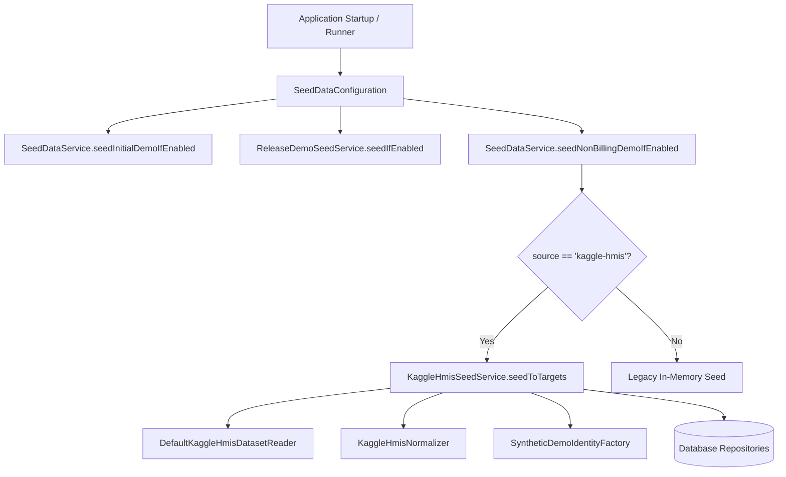

# Kaggle HMIS Production Demo Seeding

## 1. Overview & Provenance

This document specifies the production demo seed architecture backed by the licensed **Hospital Management Information System (HMIS)** dataset from Kaggle.

- **Source Dataset**: `hospital-management-system` (19 relational CSV tables)
- **Local Directory**: `backend/start/src/main/resources/seed-data/kaggle/hospital-hmis/`
- **Integrity**: Verified via SHA-256 checksums in `CHECKSUMS.sha256`
- **License & Rights**: Permitted for demo/testing purposes with synthetic transformations

---

## 2. Target Quantities & Schema Mapping

The demo seed populates realistic hospital data to meet production-like query and indexing targets:

| Target Domain | Target Count | Kaggle HMIS Source Table(s) | Normalization & Synthetic Transformation |
|---|---|---|---|
| **Specialty Departments** | `20` | `department.csv` | Canonical 20 departments (`Emergency`, `Cardiology`, `Radiology`, etc.) with consultation service pricing |
| **Doctor Clinicians** | `50` | `doctor.csv` + `employee.csv` | Synthetic email `kaggle.doctor.<id>@hospital.demo`, Vietnamese phone format, hashed password |
| **Patients** | `500` | `patient.csv` | Deterministic synthetic identity, encrypted CCCD (AES) & SHA-256 hash, synthetic email `kaggle.patient.<id>@example.com` |
| **Doctor Availability** | `14 Days` | Generated | 5 slots/day (`08:00`, `09:00`, `10:00`, `13:30`, `14:30`) set to `AVAILABLE` for future booking |
| **Appointments** | `1,000` | `admission.csv` | Mapped statuses (`CONFIRMED`, `DONE`, `CANCELLED`), past and future date offsets, booked `TimeSlotEntity` |
| **Pharmacy Inventory** | `200` | `drug.csv` + `drug_inventory.csv` | SKU `KGH-DRUG-<id>`, Lot `KGH-LOT-<id>`, Category, Stock and `IMPORT` movements |
| **Clinical Records** | `~450` | Generated from DONE appointments | Medical records with clinical notes, vital signs, prescription items linking to inventory |
| **Lab Results** | `~250` | Generated from DONE appointments | Hematology/CBC lab results with reference ranges and doctor comments |
| **Audit Logs** | `1,000` | Staff actions | Synthetic audit event records (`DEMO_SEED_APPOINTMENT_CREATE`, etc.) |

---

## 3. Architecture & Separation of Concerns



### Key Components

1. **`DefaultKaggleHmisDatasetReader`**: Streamlined RFC 4180 CSV parser that validates presence and headers across all 19 relational tables without loading entire unneeded payloads into memory at once.
2. **`KaggleHmisNormalizer`**: Handles domain mapping, canonical department aliases, standard blood groups (`A+`, `B+`, `O+`, `AB+`), and status enums.
3. **`SyntheticDemoIdentityFactory`**: Pure function deterministic generator producing compliant PII tokens (encrypted CCCD, Vietnamese demo telephone numbers, and RFC-compliant emails).
4. **`KaggleHmisSeedService`**: Transactional seed runner that enforces `DemoSeedPolicy`, calculates deficits against existing database rows, and writes records in batches of `100` to prevent OOM errors on constrained hosting environments (such as Render 512MB free tier).

---

## 4. Environment Variables & Configuration

Configure via `application.yml` or container environment variables:

| Variable Name | Default Value | Description |
|---|---|---|
| `HMS_NON_BILLING_DEMO_ENABLED` | `false` | Enable/disable non-billing production demo seeding |
| `HMS_NON_BILLING_DEMO_SOURCE` | `kaggle-hmis` | Data source strategy (`kaggle-hmis` or `default`) |
| `HMS_NON_BILLING_DEMO_DATASET_ROOT` | `classpath:seed-data/kaggle/hospital-hmis` | Dataset directory root (classpath or file URI) |
| `HMS_DEMO_DOCTOR_PASSWORD` | *(None - Required if enabled)* | Initial password for demo clinician accounts |
| `HMS_NON_BILLING_DEMO_DEPARTMENTS` | `20` | Target department count |
| `HMS_NON_BILLING_DEMO_DOCTORS` | `50` | Target clinician user count |
| `HMS_NON_BILLING_DEMO_PATIENTS` | `500` | Target synthetic patient count |
| `HMS_NON_BILLING_DEMO_APPOINTMENTS` | `1000` | Target appointment count |
| `HMS_NON_BILLING_DEMO_INVENTORY_ITEMS`| `200` | Target inventory item count |
| `HMS_NON_BILLING_DEMO_AUDIT_LOGS` | `1000` | Target audit log event count |

---

## 5. Security & Compliance Invariants

1. **No Real Patient PII**: All patient identities, contact details, and emails are synthetically generated using reserved domains (`@example.com`, `@hospital.demo`).
2. **Deterministic Encryption**: All Vietnamese Citizen Identity Card (CCCD) numbers are protected through AES encryption and hashed using SHA-256 HMAC before database persistence.
3. **Restricted Environments**: Seeding is guarded by `DemoSeedPolicy`, ensuring non-billing demo seed cannot run in unapproved production contexts without explicit configuration.
4. **Idempotent Operations**: The seeder evaluates the deficit between the current database state and the target count (`deficit = Math.max(target - currentCount, 0)`). Re-running the seeder on an existing database will not duplicate records.

---

## 6. Verification & Automated Tests

To execute the automated verification suite:

```bash
# Run dataset parser tests
mvn test -pl application -Dtest="KaggleHmisDatasetReaderTest"

# Run normalization and synthetic identity tests
mvn test -pl application -Dtest="KaggleHmisNormalizerTest,SyntheticDemoIdentityFactoryTest"

# Run seeder unit tests
mvn test -pl application -Dtest="KaggleHmisSeedServiceTest"

# Run end-to-end certification and idempotency test
mvn test -pl application -Dtest="KaggleHmisSeedCertificationTest"
```
